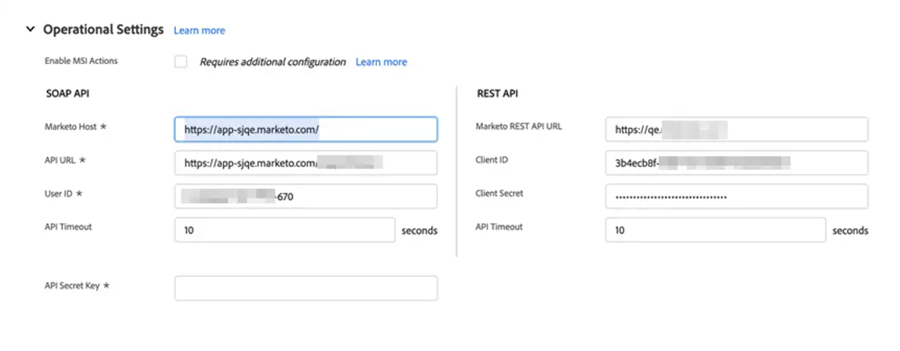

# 在[!DNL Marketo Sales Insight] Enterprise/Unlimited中配置[!DNL Salesforce] {#configure-marketo-sales-insight-in-salesforce-enterprise-unlimited}

完成以下步骤，在Marketo Enterprise/Unlimited版本中配置Salesforce Sales Insight 。

>[!PREREQUISITES]
>
>在[AppExchange [!DNL Marketo Sales Insight] 中 [!DNL Salesforce] 安装](/help/marketo/product-docs/marketo-sales-insight/msi-for-salesforce/installation/install-marketo-sales-insight-package-in-salesforce-appexchange.md)包

>[!NOTE]
>
>**需要管理员权限。**

## 在Marketo Engage中配置Sales Insight {#configure-sales-insight-in-marketo}

1. 要在Marketo Engage中获取Marketo Sales Insight凭据，请转到&#x200B;**[!UICONTROL Admin]**&#x200B;区域并选择&#x200B;**[!UICONTROL Sales Insight]**。

   

1. 单击 **[!UICONTROL Edit API Configuration]**。

   

1. 输入您选择的API密钥，然后单击&#x200B;**[!UICONTROL Save]**。 请勿在API密钥中使用&amp;符号(`&`)。

   

   >[!NOTE]
   >
   >您的API密钥与组织的密码类似，应当是安全的。

1. 要填充凭据，请单击&#x200B;**[!UICONTROL View]**&#x200B;面板中的&#x200B;_[!UICONTROL Rest API Configuration]_。

   

1. 当看到确认对话框时，单击&#x200B;**[!UICONTROL OK]**。

   

   >[!TIP]
   >
   >保持这个窗口打开。 您稍后需要此信息才能进行Salesforce配置。

## 填充新的Rest API凭据 {#populate-new-rest-api-credentials}

1. 首次填充Rest API凭据时，_查看_&#x200B;按钮将更改为&#x200B;_编辑_。 单击&#x200B;**编辑**&#x200B;按钮。

   

1. 此时将显示一条消息，确认您要重新生成API凭据。 单击&#x200B;**保存**。

   {width="800" zoomable="yes"}

1. 填充新凭据后，在Salesforce实例的&#x200B;_Marketo配置_&#x200B;选项卡中更新它们。

   

## 在[!DNL Sales Insight]中配置[!DNL Salesforce] {#configure-sales-insight-in-salesforce}

1. 在Salesforce中，单击&#x200B;**[!UICONTROL Setup]**。

   

1. 搜索“远程站点”并选择&#x200B;**[!UICONTROL Remote Site Settings]**。

   

1. 单击 **[!UICONTROL New Remote Site]**。

   

1. 输入远程站点名称（它可以类似于`MarketoSoapAPI`）。 输入远程站点URL，它是Marketo Engage中&#x200B;_[!UICONTROL Soap API Configuration]_&#x200B;面板的Marketo主机URL。 单击&#x200B;**[!UICONTROL Save]**。 您现在已为Soap API创建了远程站点设置。

   

1. 再次单击&#x200B;**[!UICONTROL New Remote Site]**。

   

1. 输入远程站点名称（它可以类似于`MarketoAPI`）。 输入远程站点URL，它是Marketo Engage中&#x200B;_[!UICONTROL Rest API Configuration]_&#x200B;面板的API URL。 单击&#x200B;**[!UICONTROL Save]**。 您现在已为Rest API创建了远程站点设置。

   >[!NOTE]
   >
   >_您_&#x200B;选择您的&#x200B;**[!UICONTROL Remote Site Name]** （此处使用了`MarketoAPI`）。 **[!UICONTROL Remote Site URL]**&#x200B;位于“在Marketo中配置Sales Insight”部分步骤3中“编辑API配置”对话框的“Marketo主机”字段中。

## 授予Sales Insight用户配置文件对标准Salesforce对象的访问权限 {#grant-sales-insight-users-profile-access}

由于Salesforce安全增强，AppExchange包无法再向标准对象授予权限，必须从Salesforce用户的配置文件向相关的Salesforce对象授予访问权限。 要授予所需的权限，请执行以下步骤。

1. 单击 **[!UICONTROL Setup]**。

1. 在快速查找中搜索“配置文件”。

1. 单击Salesforce用户正在使用的配置文件旁边的&#x200B;**[!UICONTROL Edit]**。

1. 在&#x200B;_[!UICONTROL Standard Object Permission]_&#x200B;部分下，启用以下对象的&#x200B;**[!UICONTROL Read]**&#x200B;访问权限： [!UICONTROL Lead]、[!UICONTROL Contact]、[!UICONTROL Account]和[!UICONTROL Opportunity]。

1. 单击 **[!UICONTROL Save]**。

## 自定义页面布局 {#customize-page-layouts}

1. 单击 **[!UICONTROL Setup]**。

   

1. 搜索“页面布局”并选择&#x200B;**[!UICONTROL Page Layout]**&#x200B;下的&#x200B;**[!UICONTROL Leads]**。

   

1. 单击左侧的&#x200B;**[!UICONTROL Visualforce Pages]**。 将&#x200B;**[!UICONTROL Section]**&#x200B;拖到&#x200B;_[!UICONTROL Custom Links]_&#x200B;分区下的布局。

   

1. 输入“Marketo Sales Insight”作为&#x200B;**[!UICONTROL Section Name]**，选择&#x200B;**[!UICONTROL 1-Column]**，然后单击&#x200B;**[!UICONTROL OK]**。

   

1. 将&#x200B;**[!UICONTROL Lead]**&#x200B;拖放到新分区中。

   

   >[!TIP]
   >
   >此框的名称会根据对象类型而更改。 例如，如果您正在修改“联系人”的页面布局，则会显示“联系人”。

1. 双击刚刚添加的&#x200B;**[!UICONTROL Lead]**&#x200B;块。

   

1. 将高度编辑为&#x200B;**450**&#x200B;像素，然后单击&#x200B;**[!UICONTROL OK]**。

   

   >[!NOTE]
   >
   >如果需要访问滚动浏览活动，请选中&#x200B;**[!UICONTROL Show scrollbars]**。

   >[!TIP]
   >
   >Accounts和Opportunities对象的建议高度为410像素。

1. 单击左侧的&#x200B;**[!UICONTROL Fields]**。 然后搜索&#x200B;**[!UICONTROL Urgency]**&#x200B;标签并将其拖到&#x200B;**[!UICONTROL Marketo Sales Insight]**&#x200B;布局中。

   

1. 对这些字段也重复上述步骤。

   * 最后一个有趣的时刻
   * 上一个有趣时刻的日期
   * 上一个有趣时刻说明
   * Source上一个有趣的时刻
   * 上一个有趣时刻类型
   * 按销售人员列出的最后一次活动
   * 按销售人员列出的最后一次参与
   * MSI联系人ID
   * 相对分数
   * 相对得分值
   * 紧急
   * 紧急值
   * 在Marketo中查看

1. 完成后单击 **[!UICONTROL Save]**。

   

1. 重复步骤5 - 7以添加&#x200B;**[!UICONTROL Contact]**、**[!UICONTROL Account]**&#x200B;和&#x200B;**[!UICONTROL Opportunity]**&#x200B;的Visualforce页面部分和Sales Insight字段。

1. 重复步骤8至10，为&#x200B;**[!UICONTROL Contact]**&#x200B;添加这些Sales Insight字段。 请确保保存所有更改。

   * 最后一个有趣的时刻
   * 上一个有趣时刻的日期
   * [!UICONTROL Last Interesting Moment Desc]
   * [!UICONTROL Last Interesting Moment Source]
   * [!UICONTROL Last Interesting Moment Type]
   * [!UICONTROL Last Marketo Activity by Sales]
   * [!UICONTROL Last Marketo Engagement by Sales]
   * [!UICONTROL MKTO Lead Score]
   * [!UICONTROL Relative Score]
   * [!UICONTROL Relative Score Value]
   * [!UICONTROL Sales Insight] — 打开联系人完整列表页面
   * [!UICONTROL Urgency]
   * [!UICONTROL Urgency Value]

## 映射自定义人员字段 {#map-custom-person-fields}

Marketo人员字段必须映射到Salesforce联系人字段，以确保转换正常工作。 按照以下步骤映射它们。

1. 单击 **[!UICONTROL Setup]**。

   

1. 在搜索栏中搜索“字段”，然后单击&#x200B;**[!UICONTROL Fields]**&#x200B;下的&#x200B;**[!UICONTROL Leads]**。

   

1. 单击 **[!UICONTROL Map Lead Fields]**。

   

1. 单击&#x200B;**[!UICONTROL Engagement]**&#x200B;右侧的下拉菜单。

   

1. 在列表中选择&#x200B;**[!UICONTROL Contact.Engagement]**。

   

1. 重复并映射这些字段。

   | Marketo人员自定义字段 | Salesforce联系人自定义字段 |
   |--- |--- |
   | `Engagement` | `Contact.Engagement` |
   | `Relative Score Value` | `Contact.Relative Score Value` |
   | `Urgency Value` | `Contact.Urgency Value` |
   | `Last Interesting Moment Date` | `Contact.Last Interesting Moment Date` |
   | `Last Interesting Moment Desc` | `Contact.Last Interesting Moment Desc` |
   | `Last Interesting Moment Source` | `Contact.Last Interesting Moment Source` |
   | `Last Interesting Moment Type` | `Contact.Last Interesting Moment Type` |

1. 完成后，单击&#x200B;**[!UICONTROL Save]**。

## Marketo Sales Insight的“配置”选项卡 {#marketo-sales-insight-configuration-tab}

1. 在Salesforce中，单击选项卡栏末尾的&#x200B;**+**，然后单击&#x200B;**[!UICONTROL Marketo Sales Insight Config]**。

1. 从[Marketo Sales Insight Admin页](/help/marketo/product-docs/marketo-sales-insight/msi-for-salesforce/configuration/configure-marketo-sales-insight-in-salesforce-professional-edition.md#set-up-marketo-sales-insight){target="_blank"}中的Soap API面板复制凭据，并将其粘贴到[!DNL Salesforce] [!DNL Sales Insight]配置页的Soap API部分。

1. 从[Marketo Sales Insight管理页面](/help/marketo/product-docs/marketo-sales-insight/msi-for-salesforce/configuration/configure-marketo-sales-insight-in-salesforce-professional-edition.md#set-up-marketo-sales-insight){target="_blank"}中的Rest API面板复制凭据，并将其粘贴到[!DNL Salesforce] [!DNL Sales Insight]配置页面的Rest API部分。

   

您应该能够看到Marketo Sales Insight中的Leads 、 Contacts 、 Accounts和Opportunities字段。

>[!NOTE]
>
>如果诊断测试失败，[向页面布局添加更多字段](https://nation.marketo.com:443/t5/knowledgebase/how-to-repair-marketo-sales-insight-setup-configuration-problems/ta-p/248218){target="_blank"}可能会修复此问题。

>[!NOTE]
>
>对于客户，Sales Insight包括所有电子邮件，但只包括最近有趣的时刻、Web活动和分数更改。

>[!MORELIKETHIS]
>
>* [优先级、紧迫性、相对分数和最佳匹配](/help/marketo/product-docs/marketo-sales-insight/msi-for-salesforce/features/stars-and-flames/priority-urgency-relative-score-and-best-bets.md)
>* [将Marketo选项卡添加到 [!DNL Salesforce]](/help/marketo/product-docs/marketo-sales-insight/msi-for-salesforce/configuration/add-marketo-tab-to-salesforce.md)
>* [添加Sales Insight访问用户档案的权限](/help/marketo/product-docs/marketo-sales-insight/msi-for-salesforce/configuration/add-sales-insight-access-to-profiles.md){target="_blank"}
