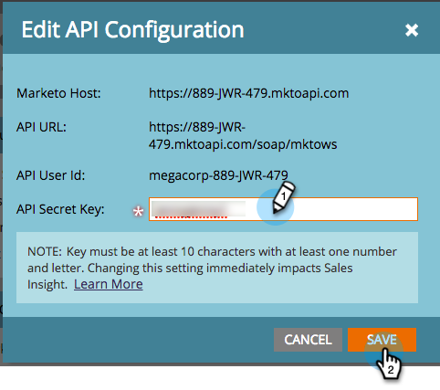

# 在Salesforce Professional Edition中配置Marketo Sales Insight {#configure-marketo-sales-insight-in-salesforce-professional-edition}

以下是配置Salesforce Professional Edition中的Marketo Sales Insight所需的步骤。 让我们开始吧。

>[!PREREQUISITES]
>
>* 在Salesforce Professional Edition中安装Marketo。
>
>* [在SalesforceAppExchange中安装Marketo Sales Insight包](/help/marketo/product-docs/marketo-sales-insight/msi-for-salesforce/installation/install-marketo-sales-insight-package-in-salesforce-appexchange.md){target="_blank"}

>[!NOTE]
>
>**需要管理员权限**

## 在Marketo中配置Sales Insight {#configure-sales-insight-in-marketo}

1. 打开一个新的浏览器窗口，以从您的Marketo帐户中获取Marketo Sales Insight凭据。
1. 转到管理区域并选择 **销售分析**.

   

1. 单击 **编辑API配置**.

   

1. 输入您选择的API密钥，然后单击 **保存**. 请勿在API密钥中使用&amp;符号。

   

   >[!NOTE]
   >
   >您的API密钥与组织的密码类似，应当是安全的。

1. 单击 **视图** 在Rest API配置面板中填充凭据。

   

1. 您将看到一个确认弹出窗口。 单击 **确定**.

   

## 在Salesforce中配置销售分析 {#configure-sales-insight-in-salesforce}

1. 在Salesforce中，单击 **设置**.

   

1. 搜索“远程站点”并选择 **远程站点设置**.

   

1. 单击 **新建远程站点**.

   

1. 输入远程站点名称（可以是“MarketoSoapAPI”之类的名称）。 输入远程站点URL，它是Marketo中“Soap API配置”面板中的您的Marketo主机URL。 单击 **保存**. 您现在已为Soap API创建了远程站点设置。

   

1. 单击 **新建远程站点** 再来一次。

   

1. 输入远程站点名称（可以是“MarketoRestAPI”之类的名称）。 输入远程站点URL，它是您在Marketo的“Rest API配置”面板中的API URL。 单击 **保存**. 您现在已为Rest API创建了远程站点设置。

## 设置Marketo Sales Insight {#set-up-marketo-sales-insight}

1. 登录到您的Marketo实例，然后单击 **管理员**.

   

1. 单击 **销售分析**.

   

1. 单击 **编辑API配置**.

   

1. 输入 **API密钥** 并单击 **保存**.

   >[!CAUTION]
   >
   >请勿在API密钥中使用&amp;符号。

   

   >[!TIP]
   >
   >保持此窗口打开。 稍后您需要在Salesforce中使用此信息。

1. 返回Salesforce，单击 **设置**.

   

1. 搜索“远程站点”并单击 **远程站点设置** 下 **安全控制**.

   

1. 单击 **新建远程站点**.

   

1. 输入 **远程站点名称** 和 **远程站点URL**，然后单击 **保存**.

   

   >[!NOTE]
   >
   >您选择您的 **远程站点名称** （此处使用MarketoAPI）。 此 **远程站点URL** 可以在步骤4中“编辑API配置”对话框的“Marketo主机”字段中找到。

## 自定义页面布局 {#customize-page-layouts}

1. 单击 **设置**.

   

1. 搜索“页面布局”并选择 **页面布局** 下 **潜在客户**.

   

1. 单击 **Visualforce页面** 左边。 拖动 **章节** 至自定义链接部分下面的布局。

   

1. 输入“Marketo Sales Insight”作为 **分区名称**. 选择 **1列** 并单击 **确定**.

   

1. 拖放 **商机** 放入新章节。

   

   >[!TIP]
   >
   >此框的名称将根据对象类型进行更改。 例如，如果您正在修改Contacts的页面布局，则将显示为Contact。

1. 双击 **商机** 您刚刚添加的块。

   

1. 将高度编辑为 **450** 像素并单击 **确定**.

   

   >[!NOTE]
   >
   >Check **显示滚动条** 如果您需要访问滚动浏览活动。

   >[!TIP]
   >
   >我们建议将Accounts和Opportunities对象的高度设置为410像素。

1. 单击 **字段** 左边。 然后搜索并拖动 **参与** 标记到 **Marketo Sales Insight** 布局。

   

1. 对这些字段也重复上述步骤。

<table> 
 <tbody> 
  <tr> 
   <td colspan="1">参与</td> 
  </tr> 
  <tr> 
   <td colspan="1" rowspan="1">
相对分数值
</td> 
  </tr> 
  <tr> 
   <td colspan="1" rowspan="1">
紧急值
</td> 
  </tr> 
  <tr> 
   <td colspan="1" rowspan="1">
上一个有趣时刻日期
</td> 
  </tr> 
  <tr> 
   <td colspan="1" rowspan="1">
最后一个有趣时刻说明
</td> 
  </tr> 
  <tr> 
   <td colspan="1" rowspan="1">
上一个有趣时刻源
</td> 
  </tr> 
  <tr> 
   <td colspan="1" rowspan="1">
上一个有趣时刻类型
</td> 
  </tr> 
 </tbody> 
</table>

1. 单击 **保存** 完成后。

   

1. 重复此过程以添加Visualforce页面部分和Sales Insight字段 **联系人**， **帐户** 和 **机会**.
1. 重复步骤5 - 7以添加Contact 、 Account和Opportunity的Visualforce页面部分。 然后，重复步骤8 - 10以添加Sales Insight字段 **联系人**. 请确保在进行任何更改后进行保存。

## 映射自定义人员字段 {#map-custom-person-fields}

Marketo人员字段需要映射到Salesforce联系人字段，以确保转换正常工作。 下面是具体操作方法。

1. 单击 **设置**.

   

1. 在搜索栏中搜索“字段”，然后单击 **字段** 下 **潜在客户**.

   

1. 单击 **映射潜在客户字段**.

   

1. 单击右侧的下拉菜单以查看 **参与**.

   

1. 选择 **Contact.Engagement** 在列表中。

   

1. 重复并映射这些字段。

<table> 
 <tbody> 
  <tr> 
   <th colspan="1" rowspan="1">Marketo人员自定义字段</th> 
   <th colspan="1" rowspan="1">Salesforce联系人自定义字段</th> 
  </tr> 
  <tr> 
   <td colspan="1" rowspan="1">
参与
</td> 
   <td colspan="1" rowspan="1">
Contact.Engagement
</td> 
  </tr> 
  <tr> 
   <td colspan="1" rowspan="1">
相对分数值
</td> 
   <td colspan="1" rowspan="1">
Contact.相对分数值
</td> 
  </tr> 
  <tr> 
   <td colspan="1" rowspan="1">
紧急值
</td> 
   <td colspan="1" rowspan="1">
Contact.Urgency值
</td> 
  </tr> 
  <tr> 
   <td colspan="1" rowspan="1">
上一个有趣时刻日期
</td> 
   <td colspan="1" rowspan="1">
Contact.Last Interest Moment日期
</td> 
  </tr> 
  <tr> 
   <td colspan="1" rowspan="1">
最后一个有趣时刻说明
</td> 
   <td colspan="1" rowspan="1">
Contact.Last Interest Moment描述
</td> 
  </tr> 
  <tr> 
   <td colspan="1" rowspan="1">
上一个有趣时刻源
</td> 
   <td colspan="1" rowspan="1">
Contact.Last有趣时刻源
</td> 
  </tr> 
  <tr> 
   <td colspan="1" rowspan="1">
上一个有趣时刻类型
</td> 
   <td colspan="1" rowspan="1">
Contact.Last Interest Moment Type
</td> 
  </tr> 
 </tbody> 
</table>

1. 单击 **保存** 等你完事了。

   

## Marketo Sales Insight的“配置”选项卡 {#marketo-sales-insight-configuration-tab}

1. 在Salesforce中，单击 **+** 单击选项卡栏末尾的 **Marketo销售分析配置**.

1. 从中的Soap API面板复制凭据 [Marketo的Sales Insight管理页面](/help/marketo/product-docs/marketo-sales-insight/msi-for-salesforce/configuration/configure-marketo-sales-insight-in-salesforce-professional-edition.md#set-up-marketo-sales-insight){target="_blank"} 并将其粘贴到“Salesforce销售分析配置”页面的Soap API部分。

1. 从Rest API面板复制凭据于 [Marketo的Sales Insight管理页面](/help/marketo/product-docs/marketo-sales-insight/msi-for-salesforce/configuration/configure-marketo-sales-insight-in-salesforce-professional-edition.md#set-up-marketo-sales-insight){target="_blank"} 并将其粘贴到“Salesforce Sales Insight配置”页面的Rest API部分。

   

就是这样！ 您应该能够看到Leads 、 Contacts 、 Accounts和Opportunities的Marketo Sales Insight字段。

>[!NOTE]
>
>如果诊断测试失败，您可能需要 [向页面布局添加更多字段](https://nation.marketo.com/docs/DOC-1115){target="_blank"}.

>[!NOTE]
>
>对于客户， Sales Insight将包含所有电子邮件，但只包含最近有趣的时刻、 Web活动和分数更改。

>[!MORELIKETHIS]
>
>* [优先级、紧迫性、相对分数和最佳匹配](/help/marketo/product-docs/marketo-sales-insight/msi-for-salesforce/features/stars-and-flames/priority-urgency-relative-score-and-best-bets.md){target="_blank"}
>* [将Marketo选项卡添加到Salesforce](/help/marketo/product-docs/marketo-sales-insight/msi-for-salesforce/configuration/add-marketo-tab-to-salesforce.md){target="_blank"}
>* [添加对用户档案的销售分析访问权限](/help/marketo/product-docs/marketo-sales-insight/msi-for-salesforce/configuration/add-sales-insight-access-to-profiles.md){target="_blank"}
