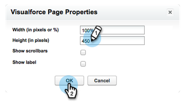

# 在Salesforce专业版中配置Marketo Sales Insight {#configure-marketo-sales-insight-in-salesforce-professional-edition}

完成以下步骤以在Salesforce Professional Edition中配置Marketo Sales Insight。

>[!PREREQUISITES]
>
>* 在Salesforce Professional Edition中安装Marketo。
>
>* [在SalesforceAppExchange中安装Marketo Sales Insight包](/help/marketo/product-docs/marketo-sales-insight/msi-for-salesforce/installation/install-marketo-sales-insight-package-in-salesforce-appexchange.md){target="_blank"}

>[!NOTE]
>
>**需要管理员权限。**

## 在Marketo Engage中配置Sales Insight {#configure-sales-insight-in-marketo}

1. 要通过Marketo帐户获取Marketo销售分析凭据，请打开一个新的浏览器窗口。

1. 转到 **[!UICONTROL 管理员]** 区域并选择 **[!UICONTROL 销售分析]**.

   

1. 单击 **[!UICONTROL 编辑API配置]**.

   

1. 输入您选择的API密钥，然后单击 **[!UICONTROL 保存]**. 不要使用&amp;符号(`&`)。

   

   >[!NOTE]
   >
   >您的API密钥与组织的密码类似，应当是安全的。

1. 要填充凭据，请单击 **[!UICONTROL 视图]** 在 _[!UICONTROL Rest API配置]_ 面板。

   

1. 如果看到确认对话框，请单击 **[!UICONTROL 确定]**.

   

## 在Salesforce中配置Sales Insight {#configure-sales-insight-in-salesforce}

1. 在Salesforce中，单击 **[!UICONTROL 设置]**.

   

1. 搜索“远程站点”并选择 **[!UICONTROL 远程站点设置]**.

   

1. 单击 **[!UICONTROL 新建远程站点]**.

   

1. 输入远程站点名称(可以类似于 `MarketoSoapAPI`)。 在Marketo Engage中输入Remote Site URL，它是从“Soap API配置”面板中显示的Marketo主机URL。 单击 **[!UICONTROL 保存]**. 您现在已为Soap API创建了远程站点设置。

   

1. 单击 **[!UICONTROL 新建远程站点]** 再来一次。

   

1. 输入远程站点名称（可以是“MarketoRestAPI”之类的名称）。 输入远程站点URL，它是您在Marketo的Rest API配置面板中的API URL。 单击 **[!UICONTROL 保存]**. 您现在已为Rest API创建了远程站点设置。

## 授予Sales Insight用户配置文件对标准Salesforce对象的访问权限 {#grant-sales-insight-users-profile-access}

由于Salesforce安全增强，AppExchange包无法再向标准对象授予权限，必须从Salesforce用户的配置文件向相关的Salesforce对象授予访问权限。 按照以下步骤授予所需权限。

1. 单击 **[!UICONTROL 设置]**.

1. 在快速查找中搜索“配置文件”。

1. 单击 **[!UICONTROL 编辑]** ，位于您的Salesforce用户正在使用的配置文件旁边。

1. 在“标准对象权限”部分下，启用以下对象的读取权限：潜在客户、联系人、帐户和机会。

1. 单击&#x200B;**[!UICONTROL 保存]**。

## 自定义页面布局 {#customize-page-layouts}

1. 单击 **[!UICONTROL 设置]**.

   

1. 搜索“页面布局”并选择 **[!UICONTROL 页面布局]** 下 **[!UICONTROL 潜在客户]**.

   

1. 单击 **[!UICONTROL Visualforce页面]** 左边。 拖动 **[!UICONTROL 部分]** 至自定义链接部分下面的布局。

   

1. 输入“Marketo Sales Insight”作为 **[!UICONTROL 区域名称]**. 选择 **[!UICONTROL 1列]** 并单击 **[!UICONTROL 确定]**.

   

1. 拖放 **商机** 到新章节。

   

   >[!TIP]
   >
   >此框的名称会根据对象类型而更改。 例如，如果您正在修改“联系人”的页面布局，则会显示“联系人”。

1. 双击 **[!UICONTROL 商机]** 您刚刚添加的块。

   

1. 将高度编辑为450像素，然后单击 **[!UICONTROL 确定]**.

   

   >[!NOTE]
   >
   >Check **[!UICONTROL 显示滚动条]** 如果您需要访问滚动浏览活动。

   >[!TIP]
   >
   >Accounts和Opportunities对象的建议高度为410像素。

1. 单击 **[!UICONTROL 字段]** 左边。 然后搜索并拖动 **[!UICONTROL 参与]** 标记到 **[!UICONTROL Marketo Sales Insight]** 布局。

   

1. 对以下字段重复上述步骤：

   * [!UICONTROL 参与]
   * [!UICONTROL 相对得分值]
   * [!UICONTROL 紧急值]
   * [!UICONTROL 上一个有趣时刻的日期]
   * [!UICONTROL 上一个有趣时刻说明]
   * [!UICONTROL 上一个有趣时刻源]
   * [!UICONTROL 上一个有趣时刻类型]

1. 单击 **[!UICONTROL 保存]** 完成后。

   

1. 为添加Visualforce页面部分 **[!UICONTROL 联系人]**， **[!UICONTROL 帐户]**、和 **[!UICONTROL 机会]**，重复步骤5至7。

1. 重复步骤8 - 10以添加Sales Insight字段 **[!UICONTROL 联系人]**. 请确保在进行任何更改后进行保存。

## 映射自定义人员字段 {#map-custom-person-fields}

Marketo人员字段必须映射到Salesforce联系人字段，以确保转换正常工作。 按照以下步骤映射它们。

1. 单击 **[!UICONTROL 设置]**.

   

1. 在搜索栏中搜索“字段”，然后单击 **[!UICONTROL 字段]** 下 **[!UICONTROL 潜在客户]**.

   

1. 单击 **[!UICONTROL 映射潜在客户字段]**.

   

1. 单击右侧的下拉菜单以查看 **[!UICONTROL 参与]**.

   

1. 选择 **[!UICONTROL Contact.Engagement]** 在列表中。

   

1. 同时重复并映射这些字段。

   | Marketo人员自定义字段 | Salesforce联系人自定义字段 |
   |--- |--- |
   | `Engagement` | `Contact.Engagement` |
   | `Relative Score Value` | `Contact.Relative Score Value` |
   | `Urgency Value` | `Contact.Urgency Value` |
   | `Last Interesting Moment Date` | `Contact.Last Interesting Moment Date` |
   | `Last Interesting Moment Desc` | `Contact.Last Interesting Moment Desc` |
   | `Last Interesting Moment Source` | `Contact.Last Interesting Moment Source` |
   | `Last Interesting Moment Type` | `Contact.Last Interesting Moment Type` |

   {style="table-layout:auto"}

1. 完成后，单击 **[!UICONTROL 保存]**.

   

## Marketo Sales Insight “配置”选项卡 {#marketo-sales-insight-configuration-tab}

1. 在Salesforce中，单击 **+** 单击选项卡栏末尾的 **[!UICONTROL Marketo销售分析配置]**.

1. 从中的Soap API面板复制凭据 [Marketo的销售分析管理页面](/help/marketo/product-docs/marketo-sales-insight/msi-for-salesforce/configuration/configure-marketo-sales-insight-in-salesforce-professional-edition.md#set-up-marketo-sales-insight){target="_blank"} 并将其粘贴到“Salesforce销售分析配置”页面的Soap API部分。

1. 从复制凭据 **[!UICONTROL Rest API]** 面板位于 [Marketo的销售分析管理页面](/help/marketo/product-docs/marketo-sales-insight/msi-for-salesforce/configuration/configure-marketo-sales-insight-in-salesforce-professional-edition.md#set-up-marketo-sales-insight){target="_blank"} 并将其粘贴到“Salesforce Sales Insight配置”页面的Rest API部分。

   

您应该能够看到Marketo Sales Insight中有关Leads 、 Contacts 、 Accounts和Opportunities的字段。

>[!NOTE]
>
>如果诊断测试失败， [向页面布局添加更多字段](https://nation.marketo.com/t5/knowledgebase/how-to-repair-marketo-sales-insight-setup-configuration-problems/ta-p/248218){target="_blank"} 可能会修复此问题。

>[!NOTE]
>
>对于客户， Sales Insight包括所有电子邮件，但只包括最近有趣的时刻、 Web活动和分数更改。

>[!MORELIKETHIS]
>
>* [优先级、紧迫性、相对分数和最佳匹配](/help/marketo/product-docs/marketo-sales-insight/msi-for-salesforce/features/stars-and-flames/priority-urgency-relative-score-and-best-bets.md){target="_blank"}
>* [将Marketo选项卡添加到Salesforce](/help/marketo/product-docs/marketo-sales-insight/msi-for-salesforce/configuration/add-marketo-tab-to-salesforce.md){target="_blank"}
>* [添加对用户档案的销售分析访问权限](/help/marketo/product-docs/marketo-sales-insight/msi-for-salesforce/configuration/add-sales-insight-access-to-profiles.md){target="_blank"}
