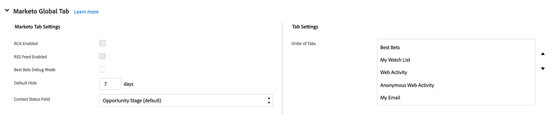
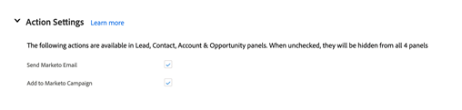

# Marketo Sales Insight的“配置”选项卡 {#marketo-sales-insight-configuration-tab-in-salesforce}

## 操作设置 {#operational-settings}

您需要设置此设置，才能开始使用SFDC中的Sales Insight。

* MSI同时使用Soap和Rest API
* 您的Marketo帐户中的“销售分析”页面将有两个相应的面板，其中包含Soap和Rest API凭据，您可以在此处复制并粘贴这些凭据
* Soap和Rest API有不同的超时，您可以根据贵组织的需求设置这些超时。 允许的最长时间为120秒
* 禁用分析功能板：您可以删除Rest API凭据并仅使用Soap API。 这样做将禁用所有MSI可视化强制面板中的分析功能板选项卡

## MSI配置 {#msi-configuration}

配置适用于所有MSI用户，并且不特定于用户档案。

**可视化强制页面设置**

* “启用操作”下拉列表：
   * 能够隐藏潜在客户和联系MSI布局中的下拉菜单中的发送Marketo电子邮件
   * 能够隐藏潜在客户和联系MSI布局中的“添加到Marketo促销活动”选项下拉框
* 即将发生的事件：能够向用户显示受邀事件和所有事件，或完全隐藏此选项卡
* 即将推出的营销活动：能够显示所有电子邮件营销活动或完全隐藏此选项卡
* 加载即将发生的营销活动和事件：能够通过将事件和促销活动选项卡放在按需“加载即将进行的项目”按钮后面，来减少用户发起的Rest API调用数
* 选项卡设置：默认情况下，所有五个选项卡都将可用。 您可以在“销售分析”面板中选择选项卡的顺序。 同一订单将适用于所有布局（潜在客户、联系人、帐户、机会）

**Marketo全局选项卡**

* 启用RSS馈送：启用后，MSI用户可以在RSS馈送中查看其潜在客户馈送（除了Salesforce中的潜在客户馈送之外）。 RSS馈送仅在禁用“令牌到期”功能时才能正常工作。 此设置在您的Marketo Sales Insight“管理员”页面中进行控制。
* 最佳调试模式
* 默认隐藏：您在此处选择的选项将是当您单击“隐藏”图标时，在Marketo的“最佳押注”选项卡中隐藏的最佳投注天数
* 联系人状态字段：您在此处选择的选项将是填充在Marketo最佳下注选项卡的状态标题列中的值
* 实时信息源设置：选择仅显示实时信息源(在“潜在客户”、“联系人”、“帐户”和“机会”面板以及“全局Marketo”页面中)、“潜在客户信息源”(在“Marketo全局”页面中)或“实时”和“潜在客户信息源”
* 选项卡设置：默认情况下，所有五个选项卡都将可用。 您可以在Marketo全局页面中选择选项卡的顺序

**限制**

* 默认情况下，活动（有趣的时刻、Web活动、电子邮件）设置为1000。 电子邮件促销活动和事件默认设置为200
* 如果您发现组织存在超时问题，可以降低限制

**操作设置**

* 发送Marketo电子邮件：启用此功能后，所有Sales Insight用户都将有权从“潜在客户”、“联系人”、“帐户”、“机会”面板和“最佳下注”选项卡（批量操作和内联参与）发送电子邮件
* 添加到Marketo Campaign:启用此功能后，所有Sales Insight用户都将有权从“潜在客户”、“联系人”、“帐户”、“机会”面板和“最佳下注”选项卡（批量操作和内联参与）添加到促销活动

## 重置Marketo Sales Insight {#reset-marketo-sales-insight}

选择这样做将擦除SFDC中的所有配置，并且无法恢复这些配置。 您必须重新配置所有内容。

>[!MORELIKETHIS]
>
>[为团队设置销售分析](/help/marketo/product-docs/marketo-sales-insight/msi-for-salesforce/configuration/setting-up-sales-insight-for-your-team.md)
