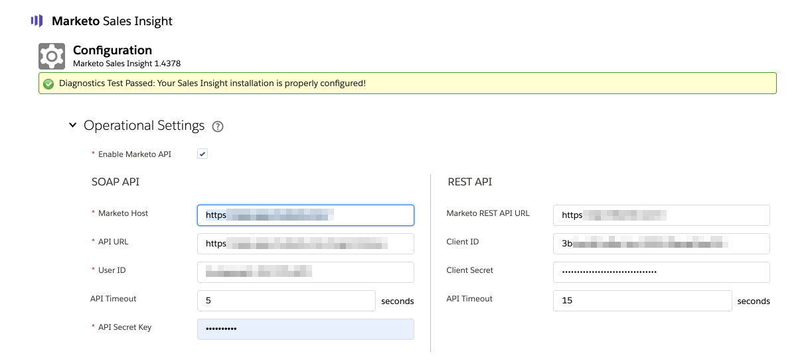

# Salesforce {#marketo-sales-insight-configuration-tab-in-salesforce}中的Marketo Sales Insight配置选项卡

## 操作设置{#operational-settings}

您需要设置此设置，才能使用SFDC中的Sales Insight进行开始。

* MSI同时使用Soap和Rest API
* 您的Marketo帐户中的“销售分析”页面将有两个对应的面板，其中包含Soap和Rest API凭据，您可以在此处复制并粘贴这些凭据
* Soap和Rest API有单独的超时时间，您可以根据组织的需要设置这些超时时间。 允许的最长时间为120秒
* 禁用分析仪表板:您可以删除Rest API凭据，并且只能使用Soap API。 否则，将禁用所有MSI可视化面板中的“分析仪表板”选项卡

## MSI配置{#msi-configuration}

配置适用于所有MSI用户，并非特定于用户档案。

**Marketo选项卡设置**

* 最佳调试模式
* 默认隐藏 — 您在此处选择的选项将是当您单击“隐藏”图标时，在Marketo的“最佳下注”选项卡中隐藏最佳下注的天数
* 联系人状态字段 — 您在此处选择的选项将是在Marketo中“最佳下注”选项卡的“状态标题”列中填充的值
* 选项卡设置 — 默认情况下，所有5个选项卡都可用。 您可以在Marketo全局页面中选择标签的顺序

**Visualforce页面设置**

* 启用操作下拉列表：

   * 能够在潜在客户和联系人MSI布局的下拉列表中隐藏发送Marketo电子邮件
   * 能够隐藏“Lead &amp; Contact MSI布局”中的“Add to Marketo活动”选项

* 即将推出的事件:能够向用户显示受邀事件、所有事件或完全隐藏此选项卡
* 即将推出的活动:能够显示所有电子邮件活动或完全隐藏此选项卡
* 选项卡设置 — 默认情况下，所有5个选项卡都可用。 默认情况下，所有5个选项卡都将可用。 您可以在“销售分析”面板中选择标签的顺序。 同一订单将适用于所有布局（潜在客户、联系人、帐户、业务机会）

**限制**

* 活动(“有趣的时刻”、“Web活动”、“电子邮件”)默认设置为1000。 默认情况下，电子邮件活动和事件设置为200
* 如果您注意到组织中存在超时问题，您可以降低限制

## 重置Marketo Sales Insight {#reset-marketo-sales-insight}

选择执行此操作将擦除SFDC中的所有配置，并且无法恢复它们。 您必须重新配置所有内容。

