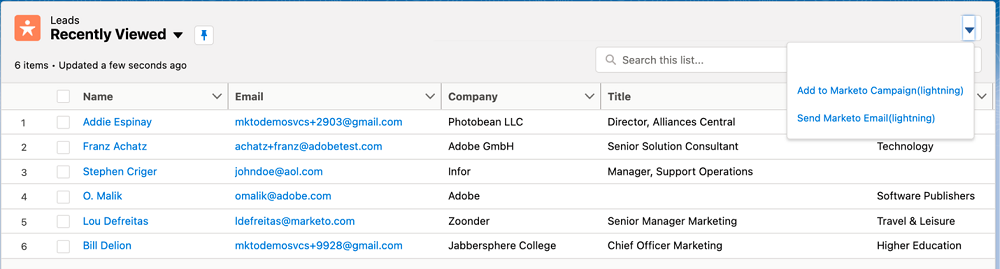

# 在Sales Insight中选择一项操作 {#choose-an-action-in-sales-insight}

Salesforce Classic和Lightning中的“销售分析”下拉列表中提供了以下操作：

* 发送Marketo电子邮件
* 添加到Marketo Campaign
* 添加到监视列表

可从以下位置访问以下每个功能：

**使用单个操作的页面布局**

* 潜在客户布局面板：单个操作，可由用户配置文件控制
* 联系布局面板：单个操作，可由用户配置文件控制
* “潜在客户布局”按钮：单个操作，不能由用户配置文件控制
* “联系人布局”按钮：单个操作，不能由用户配置文件控制

   

**具有组操作的页面布局**

* 帐户布局面板：组操作，可由用户配置文件控制
* 机会布局面板：组操作，可由用户配置文件控制

   

**“最佳下注”选项卡**

* 最佳批量操作选项卡：组操作，可由用户配置文件控制

   

* 最佳串联操作选项卡：单个操作，可由用户配置文件控制

   

**具有批量操作的列表视图**

* 潜在客户列表视图：批量操作，不能由用户配置文件控制
* 联系人列表视图：批量操作，不能由用户配置文件控制

   
