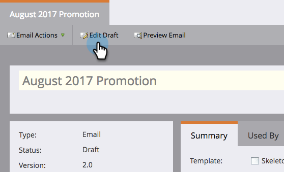
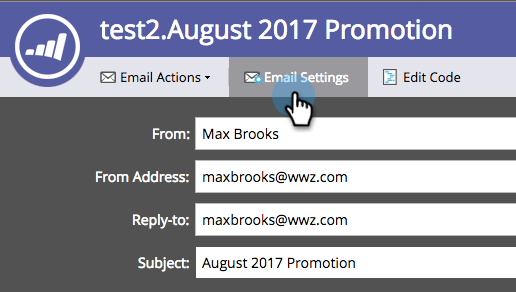

# 锁定销售模板 {#lock-sales-template}

为了阻止CRM用户编辑销售模板，管理员可以启用锁定模板的功能，然后允许用户从电子邮件编辑器单独锁定模板。

>[!CAUTION]
>
>此功能仅适用于Salesforce，与Microsoft Dynamics或其他CRM不兼容。 不会锁定从Outlook或Gmail插件访问的模板，因为编辑器不受Marketo控制。

## 启用锁定模板 {#enable-lock-template}

>[!NOTE]
>
>**需要管理员权限**

1. 转到 **管理员**，然后单击 **销售分析**.

   

1. 下 **设置**，单击 **编辑**.

   

1. Check **启用锁定模板的功能**. 单击 **保存**.

   

>[!NOTE]
>
>默认情况下，此框处于选中状态，并且已启用锁定模板的功能。 取消选中该复选框将在电子邮件编辑器中禁用锁定模板功能。

>[!NOTE]
>
>以管理员身份更改此设置将会 **非** 会追溯影响现有模板；即，它不会自动锁定这些模板。

## 在电子邮件编辑器中锁定模板 {#lock-template-in-the-email-editor}

1. 选择要锁定的电子邮件，然后单击 **编辑草稿**.

   

1. 在电子邮件编辑器中，单击 **电子邮件设置**.

   

1. Check **发布到Marketo Sales Insight** 如果还没检查过。 您现在可以取消选中 **允许CRM用户编辑电子邮件** 以锁定模板。 单击 **保存**.

   

   >[!NOTE]
   >
   >默认情况下，此框处于选中状态，并允许CRM用户编辑电子邮件。
