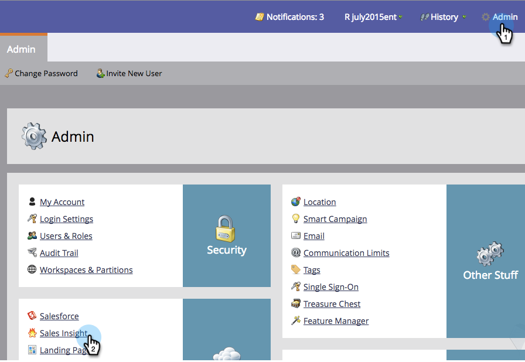

# 锁定销售模板 {#lock-sales-template}

为了阻止CRM用户编辑销售模板，管理员可以启用锁定模板的功能，然后允许用户从电子邮件编辑器单独锁定模板。

>[!CAUTION]
>
>此功能仅适用于[!DNL Salesforce]，与[!DNL Microsoft Dynamics]或其他CRM不兼容。 不会锁定从[!DNL Outlook]或Gmail插件访问的模板，因为编辑器不受Marketo控制。

## 启用锁定模板 {#enable-lock-template}

>[!NOTE]
>
>**需要管理员权限**

1. 转到&#x200B;**[!UICONTROL Admin]**，然后单击&#x200B;**[!UICONTROL Sales Insight]**。

   

1. 在&#x200B;**[!UICONTROL Settings]**&#x200B;下，单击&#x200B;**[!UICONTROL Edit]**。

   

1. 检查&#x200B;**[!UICONTROL Enable ability to lock templates]**。 单击 **[!UICONTROL Save]**。

   

>[!NOTE]
>
>默认情况下，此框处于选中状态，并且已启用锁定模板的功能。 取消选中该复选框将在电子邮件编辑器中禁用锁定模板功能。

>[!NOTE]
>
>将此设置更改为管理员将&#x200B;**不会**&#x200B;回溯影响现有模板；也就是说，它不会自动锁定这些模板。

## 在电子邮件编辑器中锁定模板 {#lock-template-in-the-email-editor}

1. 选择要锁定的电子邮件，然后单击&#x200B;**[!UICONTROL Edit Draft]**。

   

1. 在电子邮件编辑器中，单击&#x200B;**[!UICONTROL Email Settings]**。

   

1. 检查&#x200B;**[!UICONTROL Publish to Marketo Sales Insight]**（如果尚未检查）。 您现在可以取消选中&#x200B;**[!UICONTROL Allow CRM user to edit email]**&#x200B;以锁定模板。 单击 **[!UICONTROL Save]**。

   

   >[!NOTE]
   >
   >默认情况下，此框处于选中状态，并允许CRM用户编辑电子邮件。
