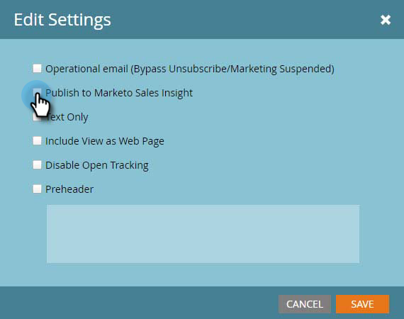

# 将电子邮件发布到Sales Insight {#publish-an-email-to-sales-insight}

启用“发布到销售分析”设置，可向销售团队在Sales Insight以及Outlook和Gmail Add-In中提供电子邮件。 您还可以给它一个过期日期。

1. 找到您的电子邮件，选择它，然后单击&#x200B;**编辑草稿**。

   

1. 编辑器打开后，单击&#x200B;**电子邮件设置**。

   

1. 选中&#x200B;**发布到Marketo Sales Insight**。

   

1. 要设置过期日期（可选），请选中&#x200B;**设置过期日期**&#x200B;并选择日期。

   

   >[!NOTE]
   >
   >在晚上11点59分(CST))，在过期日期（如果设置），您提供的电子邮件将从Sales Insight及其任何加载项中消失。 当然，Marketo仍可访问它。

1. 单击&#x200B;**保存**。

   

干得好！ 现在，您了解如何让销售团队在CRM端发送电子邮件，并在必要时限制其可用时间。

>[!NOTE]
>
>[当从Microsoft ](/help/marketo/product-docs/core-marketo-concepts/programs/tokens/understanding-my-tokens-in-a-program.md) Dynamics或Salesforce上的Sales Insight发送电子邮件时，My Tokens将无法解析；只有标准令牌才会填充(潜在客户、公司等)。但是，令牌的默认值将有效。

>[!TIP]
>
>不要忘记批准此电子邮件，以使更改生效。 了解如何[批准电子邮件](/help/marketo/product-docs/email-marketing/general/creating-an-email/approve-an-email.md)。
