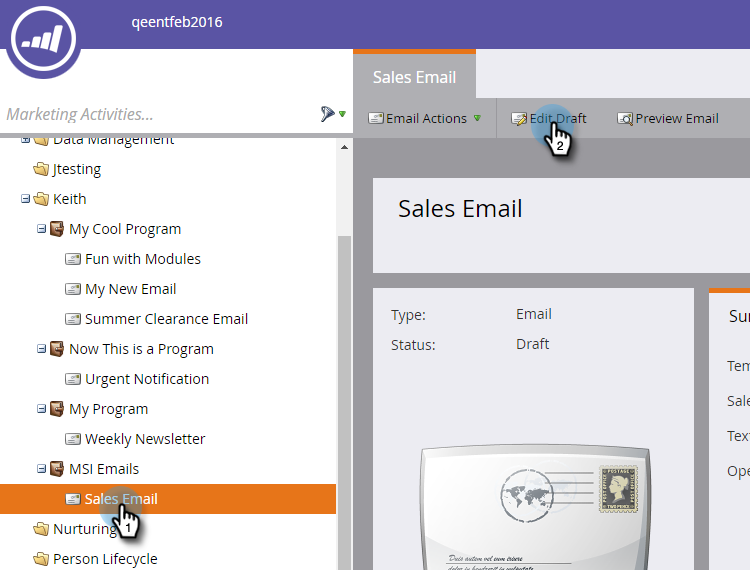
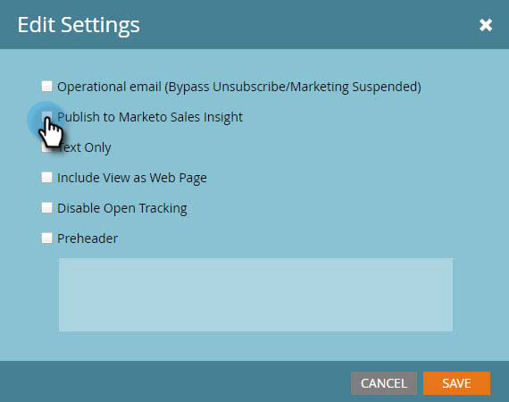

# 将电子邮件发布到[!DNL Sales Insight] {#publish-an-email-to-sales-insight}

启用“发布到[!DNL Sales Insight]”设置，使您的销售团队可以在[!DNL Sales Insight]以及[!DNL Outlook]和Gmail加载项中使用电子邮件。 您还可以为其指定到期日期。

1. 查找您的电子邮件，选择它并单击&#x200B;**[!UICONTROL Edit Draft]**。

   

1. 编辑器打开后，单击&#x200B;**[!UICONTROL Email Settings]**。

   

1. 检查&#x200B;**[!UICONTROL Publish to Marketo Sales Insight]**。

   

1. 要设置到期日期（可选），请选中&#x200B;**[!UICONTROL Set Expiration]**&#x200B;并选择日期。

   

   >[!NOTE]
   >
   >在过期日期的下午11:59 (CST)（如果您设置了），您提供的电子邮件将从[!DNL Sales Insight]及其任何加载项中消失。 当然，您仍然可以在Marketo中访问该站点。

1. 单击 **[!DNL Save]**。

   

做得好！ 现在，您已了解如何让销售团队可在CRM端发送电子邮件，并在必要时限制其可用时间。

>[!NOTE]
>
>在[!DNL Microsoft Dynamics]或[!DNL Salesforce]上从[!DNL Sales Insight]发送电子邮件时，[我的令牌](/help/marketo/product-docs/core-marketo-concepts/programs/tokens/understanding-my-tokens-in-a-program.md)无法解析；将仅填充标准令牌（潜在客户、公司等）。 但是，令牌的默认值将有效。

>[!TIP]
>
>请别忘了批准此电子邮件，以使更改生效。 了解如何[批准电子邮件](/help/marketo/product-docs/email-marketing/general/creating-an-email/approve-an-email.md)。
