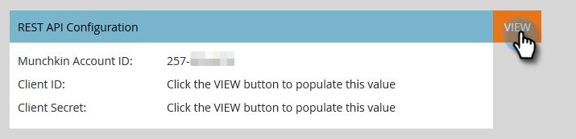

# 现有客户的配置 {#configuration-for-existing-customers}

请设置以下配置以开始使用新的“分析”仪表板。

>[!PREREQUISITES]
>
>请确保已将您的Salesforce包升级到最新版本

## 在Marketo中配置销售分析 {#configure-sales-insight-in-marketo}

1. 在您的浏览器中打开新选项卡，从您的Marketo帐户获取Marketo Sales Insights凭据。
1. 转到“管 **理** ”区域。

   

1. 单击 **销售分析**。

   

1. 单击 **视图** ，以填充Rest API凭据。

   

1. 您将看到确认弹出窗口。 单击 **确定**。

## 在Salesforce中配置销售分析 {#configure-sales-insight-in-salesforce}

1. 在Salesforce中，单击 **设置**。

   

1. 搜索并选择“远 **程站点设置”**。

   

1. 单击“ **新建远程站点**”。

   

1. 输入远程站点名称（可以是“MarketoRestAPI”）和远程站点URL（Marketo中“Rest API配置”面板中的API URL）。

   

1. 单击 **保存**。

   

   您现在已为Rest API创建远程站点设置。

## 访问Marketto Sales Insight {#access-marketo-sales-insight}

1. 从Marketo的“销售分析管理员”页面的Rest API面板复制凭据。 将它们粘贴到Salesforce的“销售分析配置”页面的Rest API部分。
1. 输入API密钥。

   

