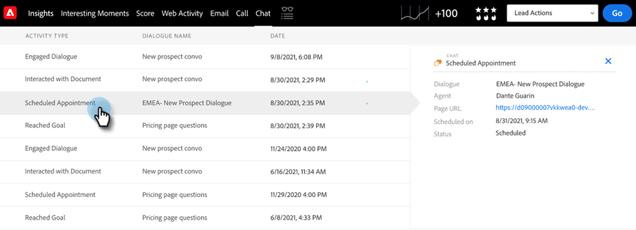

# 动态聊天集成 {#dynamic-chat-integration}

进一步了解与Sales Insight的动态聊天集成。

>[!PREREQUISITES]
>
>* 您的Sales Insight SFDC包必须是版本 [1.9或更高版本](/help/marketo/product-docs/marketo-sales-insight/msi-for-salesforce/upgrading/upgrading-your-msi-package.md){target=&quot;_blank&quot;}
>
>* 您必须拥有 [动态聊天集成](/help/marketo/product-docs/demand-generation/dynamic-chat/dynamic-chat-overview.md){target=&quot;_blank&quot;}设置

## Marketo Sales Insight“配置”选项卡 {#marketo-sales-insight-configuration-tab}

请按照以下步骤启用动态聊天集成。

1. 登录您的Salesforce帐户，单击选项卡栏末尾的+，然后单击 **Marketo Sales Insight配置**.

1. 单击以展开“Visualforce面板”。

   

1. 选择 **启用动态聊天数据** 复选框。

   

## 功能概述 {#feature-overview}

Sales Insight用户可以利用以下动态聊天活动……

参与对话：当访客单击聊天机器人并参与对话框时，登录Marketo并填充到Sales Insight中。

* 对话名称
* 页面URL
* 状态（已启动/已丢弃/已完成）

计划约会：当访客通过聊天机器人成功计划约会时，登录Marketo并填充到Sales Insight中。

* 对话名称
* 代理
* 页面URL
* 已安排在（插入日期和时间戳）
* 状态（已计划、已重新计划、已取消）

实现目标：已登录Marketo，并在访客在任何对话框流中达到目标时填充Sales Insight。

* 对话名称
* 目标名称
* 页面URL

与文档交互：当访客与通过聊天机器人共享的文档交互时，登录Marketo并填充到Sales Insight中。

* 对话名称
* 文档
* 状态

聊天活动在分析功能板中可用。

“潜在客户”和“联系人”面板中提供了“聊天”选项卡。 它包括“活动类型”、“对话框名称”和“日期”列。

您可以通过单击来进一步了解活动类型。

同样，“帐户”和“机会”面板包括“名称”、“活动类型”、“对话框名称”和“日期”列。

“聊天”选项卡还包含在“全局Marketo”选项卡中。 它包括三种活动类型（参与对话框、计划约会、已实现目标），以及以下列：

* 人员
* 帐户
* 活动类型（参与对话框、计划约会、已实现目标）
* 对话名称
* 日期和时间戳

再次重申，您可以通过单击来了解有关活动类型的更多信息。

>[!NOTE]
>
>如果禁用“启用动态聊天数据”复选框，则将禁用以下功能：
>
>* 分析功能板中聊天活动的行（智能网格和每周列表视图）
>* “潜在客户”、“联系人”、“帐户”和“机会”面板中的“聊天”选项卡
>* “全局Marketo”选项卡中的“聊天”选项卡
>
>不能只禁用其中一项功能。

