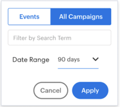

# 分析功能板功能概述 {#insights-dashboard-feature-overview}

进一步了解销售分析功能板中提供的功能。

>[!PREREQUISITES]
>
>您必须具有最新的MSI SFDC包和 [配置](/help/marketo/product-docs/marketo-sales-insight/msi-for-salesforce/configuration/configuration-for-existing-customers.md).

## 联系人布局 {#contact-layout}

**参与速度网格**

* 此智能网格包括过去90天内的有趣时刻、电子邮件和Web活动
* 用户可以选择“显示帐户”活动，这将在“联系人”视图中分层所有帐户级别的有趣时刻、电子邮件和Web活动
* 用户可以突出显示特定周以查看该周内的活动
* 默认视图：已选择当前周

**参与度细分和摘要**

* 深入查看活动卡片，以了解有趣的时刻、电子邮件和Web活动
* 有趣时刻活动卡片 — 包含订阅选项
* 电子邮件活动卡片 — 包含预览选项
* Web活动卡 — 包括单击链接的功能
* 每周摘要栏将显示该周的有趣时刻、电子邮件和Web活动。 每个图标都是可单击的，可用作显示特定活动的过滤器
* 默认视图：这是当前视图的活动列表

**即将推出的电子邮件促销活动和事件**

“电子邮件促销活动”选项卡：

* 包括计划在未来90天内发送的电子邮件项目或默认项目所包含的营销活动
* 不特定于联系人/潜在客户(即，促销活动列表是在Marketo实例中计划的所有电子邮件促销活动的通用列表)。 所有潜在客户、联系人、帐户和机会面板中的营销活动列表将相同
* 如果促销活动重复发生在接下来的90天内运行了三次以上，则在任何给定时间点(与Marketo中的行为类似)都只会显示接下来的三次运行
* 此部分中的活动详细信息卡将具有预览选项。 如果流程包含多个发送电子邮件步骤，则所有电子邮件都将可供预览。 在发送电子邮件流程步骤中，如果有多个“电子邮件选项”，则默认选项将可用于预览
* 过滤器包括“搜索”和“日期范围”

“事件”选项卡：

* 包括计划在未来90天内发生的事件程序
* 使用过滤器选项可查看所有事件/受邀事件（基于“管理员”设置）
* 选择受邀事件将显示已邀请特定联系人的事件以及成员状态
* 选择所有事件将显示计划在未来90天内的事件列表
* 此部分中的活动详细信息卡片具有预览选项
* 过滤器包括“搜索”、“仅显示受邀事件”和“日期范围”

## 潜在客户布局 {#lead-layout}

**参与速度网格**

* 此智能网格包括过去90天内的有趣时刻、电子邮件和Web活动
* 用户可以突出显示特定周以查看该周内的活动
* 默认视图：已选择当前周
* “显示帐户活动”功能在潜在客户上不可用，因为在转换为联系人之前，该功能不属于Salesforce中任何帐户的一部分

**参与度细分和摘要**

* 向下展开活动卡片，以查看有趣的时刻、电子邮件和Web活动
* 有趣时刻活动卡片 — 包含订阅选项
* 电子邮件活动卡片 — 包含预览选项
* Web活动卡 — 包括单击链接的功能
* 每周摘要栏将显示该周的有趣时刻、电子邮件和Web活动。 每个图标都是可单击的，可用作显示特定活动的过滤器
* 默认视图：这是当前视图的活动列表

**即将推出的电子邮件促销活动和事件：**

“电子邮件促销活动”选项卡：

* 包括计划在未来90天内发送的电子邮件项目或默认项目所包含的营销活动
* 不特定于联系人/潜在客户(即，促销活动列表是在Marketo实例中计划的所有电子邮件促销活动的通用列表)。 所有潜在客户、联系人、帐户和机会面板中的营销活动列表将相同
* 如果促销活动重复发生在接下来的90天内运行了三次以上，则在任何给定时间点(与Marketo中的行为类似)都只会显示接下来的三次运行
* 此部分中的活动详细信息卡将具有预览选项。 如果流程包含多个发送电子邮件步骤，则所有电子邮件都将可供预览。 在发送电子邮件流程步骤中，如果有多个“电子邮件选项”，则默认选项将可用于预览
* 过滤器包括“搜索”和“日期范围”

“事件”选项卡：

* 包括计划在未来90天内发生的事件程序
* 使用过滤器选项可查看所有事件/受邀事件（基于“管理员”设置）
* 选择受邀事件将显示已邀请特定联系人的事件以及成员状态
* 选择所有事件将显示计划在未来90天内的事件列表
* 此部分中的活动详细信息卡片具有预览选项
* 过滤器包括“搜索”、“仅显示受邀事件”和“日期范围”

## 帐户布局 {#account-layout}

**参与速度网格**

* 此智能网格包括帐户中所有联系人在过去90天内的有趣时刻、电子邮件和Web活动
* 用户可以突出显示特定周以查看该周内的活动
* 默认视图：已选择当前周

**参与度细分和摘要**

* 向下展开活动卡片，以查看有趣的时刻、电子邮件和Web活动，包括联系人姓名
* 有趣时刻活动卡片 — 包含订阅选项
* 电子邮件活动卡片 — 包含预览选项
* Web活动卡 — 包括单击链接的功能
* 每周摘要栏将显示该周的有趣时刻、电子邮件和Web活动。 每个图标都是可单击的，可用作显示特定活动的过滤器
* 默认视图：这是当前视图的活动列表

**即将推出的电子邮件促销活动和事件**

“电子邮件促销活动”选项卡：

* 包括计划在未来90天内发送的电子邮件项目或默认项目所包含的营销活动
* 不特定于联系人/潜在客户(即，促销活动列表是在Marketo实例中计划的所有电子邮件促销活动的通用列表)。 所有潜在客户、联系人、帐户和机会面板中的营销活动列表将相同
* 如果促销活动重复发生在接下来的90天内运行了三次以上，则在任何给定时间点(与Marketo中的行为类似)都只会显示接下来的三次运行
* 此部分中的活动详细信息卡将具有预览选项。 如果流程包含多个发送电子邮件步骤，则所有电子邮件都将可供预览。 在发送电子邮件流程步骤中，如果有多个“电子邮件选项”，则默认选项将可用于预览
* 过滤器包括“搜索”和“日期范围”

“事件”选项卡：

* 包括计划在未来90天内发生的事件程序
* 使用过滤器选项可查看所有事件/受邀事件（基于“管理员”设置）
* 选择受邀事件将显示已邀请特定联系人的事件以及成员状态
* 选择所有事件将显示计划在未来90天内的事件列表
* 此部分中的活动详细信息卡片具有预览选项
* 过滤器包括“搜索”、“仅显示受邀事件”和“日期范围”

## 机会布局 {#opportunity-layout}

**参与速度网格**

* 此智能网格包括Opportunity中所有联系人在过去90天内的“有趣时刻”、“电子邮件”和“Web活动”
* 用户可以突出显示特定周以查看该周内的活动
* 默认视图：已选择当前周

**参与度细分和摘要**

* 向下展开活动卡片，以查看有趣的时刻、电子邮件和Web活动，包括联系人姓名
* 有趣时刻活动卡片 — 包含订阅选项
* 电子邮件活动卡片 — 包含预览选项
* Web活动卡 — 包括单击链接的功能
* 每周摘要栏将显示该周的有趣时刻、电子邮件和Web活动。 每个图标都是可单击的，可用作显示特定活动的过滤器
* 默认视图：这是当前视图的活动列表

**即将推出的电子邮件促销活动和事件** “电子邮件促销活动”选项卡：

* 包括计划在未来90天内发送的电子邮件项目或默认项目所包含的营销活动
* 不特定于联系人/潜在客户(即，促销活动列表是在Marketo实例中计划的所有电子邮件促销活动的通用列表)。 所有潜在客户、联系人、帐户和机会面板中的营销活动列表将相同
* 如果促销活动重复发生在接下来的90天内运行了三次以上，则在任何给定时间点(与Marketo中的行为类似)都只会显示接下来的三次运行
* 此部分中的活动详细信息卡将具有预览选项。 如果流程包含多个发送电子邮件步骤，则所有电子邮件都将可供预览。 在发送电子邮件流程步骤中，如果有多个“电子邮件选项”，则默认选项将可用于预览
* 过滤器包括“搜索”和“日期范围”

“事件”选项卡：

* 包括计划在未来90天内发生的事件程序
* 使用过滤器选项可查看所有事件/受邀事件（基于“管理员”设置）
* 选择受邀事件将显示已邀请特定联系人的事件以及成员状态
* 选择所有事件将显示计划在未来90天内的事件列表
* 此部分中的活动详细信息卡片具有预览选项
* 过滤器包括“搜索”、“仅显示受邀事件”和“日期范围”

>[!NOTE]
>
>如果您的帐户或机会有超过800个联系人，则仪表板将不显示任何数据。 但是，您可以联系个人联系人，以查看他们的洞察和参与度。 如果您的帐户有800个以上的联系人，则将禁用“显示帐户级别的活动”。
