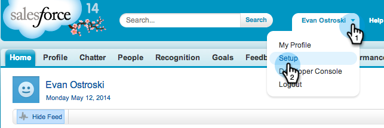

# 在 Salesforce 中为 Sales Insight 启用多语言支持 {#prepare-sales-insight-for-multi-lingual-support-in-salesforce}

>[!NOTE]
>
>**需要管理员权限**

Marketo Sales Insight按语言进行存储。 因此，如果您希望它适用于多种语言，则必须分别输入每种语言的凭据。

>[!NOTE]
>
>[!DNL Sales Insight]当前支持：
>
>* 英语
>* 法语
>* 德语
>
>任何其他语言均默认使用英语。

## 为[!DNL Marketo Sales Insight]添加新语言 {#adding-a-new-language-for-marketo-sales-insight}

1. 登录到[!DNL Salesforce]。 在右上角您姓名下的下拉菜单中，单击&#x200B;**[!UICONTROL Setup]**。

   

1. 在&#x200B;**[!UICONTROL My Personal Information]**&#x200B;下，单击&#x200B;**[!UICONTROL Personal Information]**。

   

1. 单击 **[!UICONTROL Edit]**。

   

1. 选择语言并单击&#x200B;**[!UICONTROL Save]**。

   

1. 您的[!DNL Salesforce]界面现在使用选定语言。 您可以单击&#x200B;**+**&#x200B;图标以查看所有可用选项卡。

   

1. 单击&#x200B;**[!UICONTROL Configure Marketo Sales Insight]**（使用所选语言）。

   

1. 转到Marketo。 找到您的&#x200B;[[!DNL Marketo Sales Insight] **[!UICONTROL API configuration]**详细信息](/help/marketo/product-docs/marketo-sales-insight/msi-for-salesforce/configuration/configure-marketo-sales-insight-in-salesforce-enterprise-unlimited.md#configure-marketo-sales-insight)。

   

1. 输入Marketo中的API详细信息，然后单击&#x200B;**[!UICONTROL Save]**。

   

## 将[!DNL Salesforce]改回英语 {#change-salesforce-back-to-english}

完成自定义[!DNL Salesforce]组织后，下面是如何将个人配置返回为英文的。

>[!NOTE]
>
>以下屏幕截图为法语，并附有英语说明。  您将看到与上一步中选择的语言文本相同的屏幕。

1. 在你的名称下，单击&#x200B;**[!UICONTROL Setup]**。

1. 单击&#x200B;**[!UICONTROL Personal Information]**&#x200B;下的&#x200B;**[!UICONTROL My Personal Information]**。

   

1. 单击 **[!UICONTROL Edit]**。

   

1. 从“语言”下拉列表中选择&#x200B;**[!UICONTROL English]**，然后单击&#x200B;**[!UICONTROL Save]**。

   

   现在，您的[!DNL Salesforce]已恢复使用英语！
