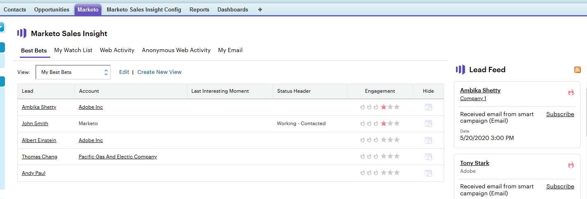

# 使用潜在客户源{#using-the-lead-feed}

潜在客户源是您的潜在客户完成的有趣事件的最新列表。 单击“Marketo”选项卡时，您将在右侧找到它。 它就像RSS或Twitter源 — 最新更新位于列表顶部。 在您还处于新思维时，使用它跳转到潜在客户。

>[!NOTE]
>
>潜在客户信息源包括您拥有的潜在客户和您的观察列表中的潜在客户。

## 潜在客户信息源包含什么？{#whats-in-the-lead-feed}

潜在客户源中的每个项目都是一个有趣的时刻 — 此潜在客户的营销历史中值得注意的活动或事件。

在Salesforce中查看时，每个项目都具有：

<table> 
 <colgroup> 
  <col> 
  <col> 
 </colgroup> 
 <tbody> 
  <tr> 
   <td>
项目
</td> 
   <td>
说明
</td> 
  </tr> 
  <tr> 
   <td>
A.潜在客户/联系人
</td> 
   <td>
有这个有趣时刻的人
</td> 
  </tr> 
  <tr> 
   <td>
B.事件类型
</td> 
   <td>
类别此刻 — Web、电子邮件或里程碑
</td> 
  </tr> 
  <tr> 
   <td>
C.帐户名称
</td> 
   <td>
公司名称
</td> 
  </tr> 
  <tr> 
   <td>
D.时间
</td> 
   <td>
当这个有趣的时刻
</td> 
  </tr> 
  <tr> 
   <td>
E.事件说明
</td> 
   <td>
这个有趣时刻的原因
</td> 
  </tr> 
  <tr> 
   <td>
F.订阅
</td> 
   <td>
接收此类事件的电子邮件通知
</td> 
  </tr> 
  <tr> 
   <td>
G.星
</td> 
   <td>
此人是最佳（高优先级）
</td> 
  </tr> 
 </tbody> 
</table>

## 获取RSS更新{#getting-rss-updates}

您还可以通过RSS源获取潜在客户源更新。  RSS源允许您接收潜在客户的更新，即使您未连接到Salesforce。 该源与Salesforce中的Lead Feed以及以下信息（如果有）相同：

* 电子邮件地址
* 电话号码
* 移动号码
* 传真号码
* 公司地址
* 公司URL

>[!NOTE]
>
>您的公司的Marketo管理员必须[启用RSS服务](/help/marketo/product-docs/marketo-sales-insight/msi-for-salesforce/features/msi-configuration-tab/enable-rss-for-sales-insight.md)才能使其正常工作。

要获取RSS更新，您需要两件事：RSS链接和RSS阅读器。 单击潜在客户源中的RSS图标可获取RSS链接：

RSS源将显示在新窗口中。 然后，您可以复制RSS源的URL并在RSS阅读器中使用它。 大多数浏览器都有内置的RSS阅读器，或者您可以使用特定于平台的RSS阅读器。
