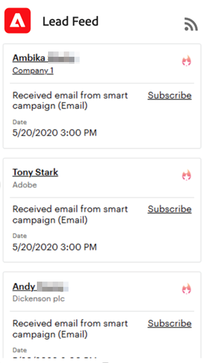

# 使用潜在客户馈送 {#using-the-lead-feed}

潜在客户信息源是潜在客户开展的重要活动的最新列表。 单击Marketo选项卡时，您将在右侧找到它。 它类似于RSS或Twitter信息源 — 最新更新位于列表顶部。 当你还在他们脑海里时，用这个来寻找潜在客户。

>[!NOTE]
>
>潜在客户馈送包括您拥有的潜在客户以及监视列表中的潜在客户。

## Lead Feed中包含什么？ {#whats-in-the-lead-feed}

商机信息源中的每个项目都是一个有趣的时刻 — 在该商机的营销历史中，这是一个值得注意的活动或事件。

在Salesforce中查看它时，每个项目都具有：

<table> 
 <colgroup> 
  <col> 
  <col> 
 </colgroup> 
 <tbody> 
  <tr> 
   <td>
项目
</td> 
   <td>
描述
</td> 
  </tr> 
  <tr> 
   <td>
A.潜在客户/联系人
</td> 
   <td>
有这个有趣时刻的人
</td> 
  </tr> 
  <tr> 
   <td>
B.事件类型
</td> 
   <td>
当前类别 — Web、电子邮件或里程碑
</td> 
  </tr> 
  <tr> 
   <td>
C.帐户名称
</td> 
   <td>
公司名称
</td> 
  </tr> 
  <tr> 
   <td>
D.时间
</td> 
   <td>
当这个有趣的时刻发生
</td> 
  </tr> 
  <tr> 
   <td>
E.事件描述
</td> 
   <td>
这个有趣时刻的原因
</td> 
  </tr> 
  <tr> 
   <td>
F.订阅
</td> 
   <td>
接收此类事件的电子邮件通知
</td> 
  </tr> 
  <tr> 
   <td>
G. Star
</td> 
   <td>
此人是最佳匹配（高优先级）
</td> 
  </tr> 
 </tbody> 
</table>

## 获取RSS更新 {#getting-rss-updates}

您还可以通过RSS馈送获取潜在客户馈送更新。  RSS馈送允许您接收有关潜在客户的更新，即使您未连接到Salesforce。 馈送的信息与Salesforce中的潜在客户馈送的信息相同，并且包含以下内容（如果可用）：

* 电子邮件地址
* 电话号码
* 手机号码
* 传真号
* 公司地址
* 公司URL

>[!NOTE]
>
>您公司的Marketo管理员必须 [启用RSS源](/help/marketo/product-docs/marketo-sales-insight/msi-for-salesforce/features/msi-configuration-tab/enable-rss-for-sales-insight.md) 才能让这招奏效。

要获取RSS更新，您需要以下两项： RSS链接和RSS馈送读取器。 您可以通过单击潜在客户馈送中的RSS图标来获取RSS链接：

RSS馈送将显示在新窗口中。 然后，您可以复制RSS馈送的URL并在RSS阅读器中使用它。 大多数浏览器具有内置的RSS读取器，或者您可以使用特定于您的平台的RSS读取器。
