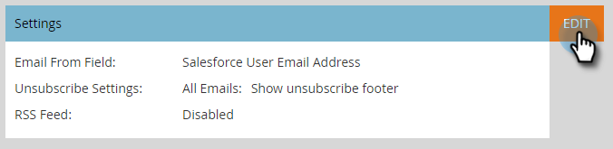

# 为[!DNL Sales Insight]启用RSS {#enable-rss-for-sales-insight}

>[!NOTE]
>
>**需要管理员权限**

如果Marketo用户希望不仅在[!DNL Salesforce]中查看其潜在客户信息源，还希望在RSS信息源中查看其潜在客户信息源，则必须先由Marketo管理员启用它。 这很容易。

1. 在“我的Marketo”中，单击&#x200B;**[!UICONTROL Admin]**，然后单击&#x200B;**[!DNL Sales Insight]**。

   

1. 在“设置”上，单击&#x200B;**[!UICONTROL Edit]**。 请注意，RSS源显示为&#x200B;**[!UICONTROL Disabled]**。

   

1. 在[!UICONTROL Edit Settings]对话框中，选中&#x200B;**[!UICONTROL RSS feed]**&#x200B;复选框，然后单击&#x200B;**[!UICONTROL Save]**。

   

   RSS源现在显示为&#x200B;**[!UICONTROL Enabled]**。

   

   一块蛋糕！
