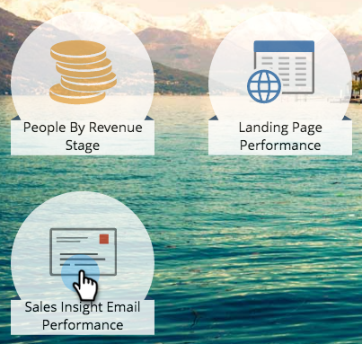
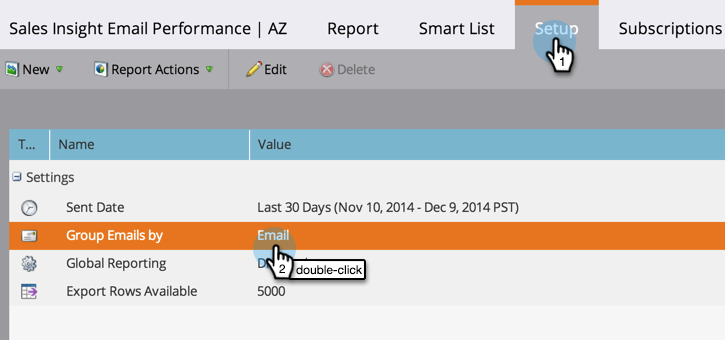
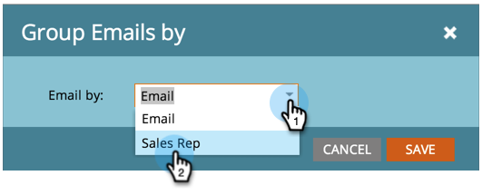
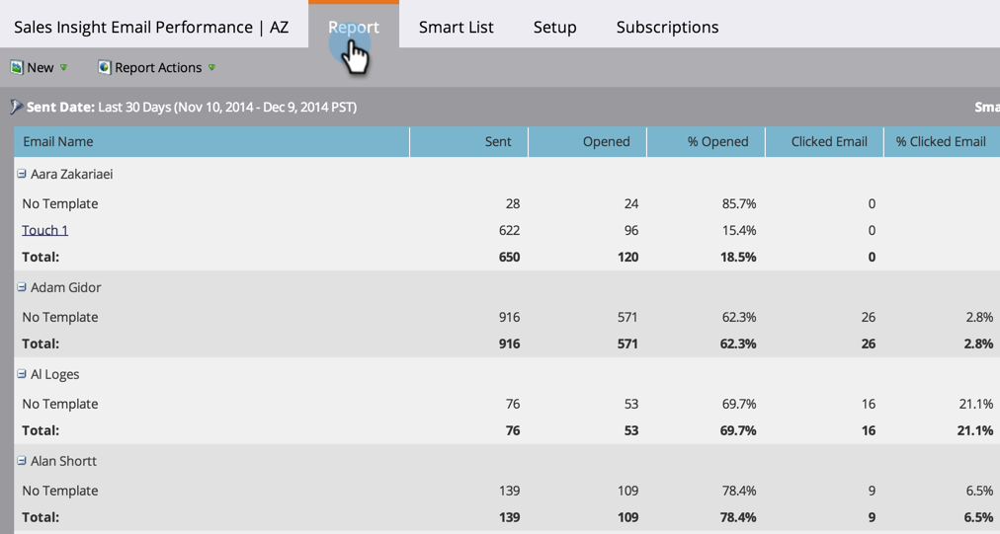

# Sales Insight 电子邮件性能报告 {#sales-insight-email-performance-report}

查看通过[!DNL Salesforce]、[!DNL Microsoft Dynamics]或Gmail或[!DNL Outlook]插件发送的电子邮件性能。

## 生成报表 {#generate-a-report}

1. 单击 **[!UICONTROL Analytics]**。

   

1. 单击 **[!UICONTROL Sales Insight Email Performance]**。

   

1. 单击&#x200B;**[!UICONTROL Setup]**&#x200B;选项卡并选择所需的值。

   

1. 单击 **[!UICONTROL Report]** 选项卡。

   

   太棒了！ 现在，您可以查看从销售团队发送的电子邮件的执行情况。

   >[!NOTE]
   >
   >对于通过Sales Insight发送的电子邮件，不会捕获其投放状态，并且不会包含在此报表或活动日志中。

>[!TIP]
>
>点击电子邮件名称，即可在电子邮件预览器中打开。

## 按[!UICONTROL Sales Rep]分组 {#group-by-sales-rep}

您可以通过更改设置来查看按销售代表分组的此报告。

1. 单击 **[!UICONTROL Setup]**。 双击&#x200B;**[!UICONTROL Email]**。

   

1. 选择按&#x200B;**[!UICONTROL Sales Rep]**&#x200B;分组电子邮件。

   

1. 单击 **[!UICONTROL Save]**。

   

1. 单击 **[!UICONTROL Report]** 选项卡。

   

   很酷吧？ 现在，您可以看到按销售代表分组的电子邮件性能。
