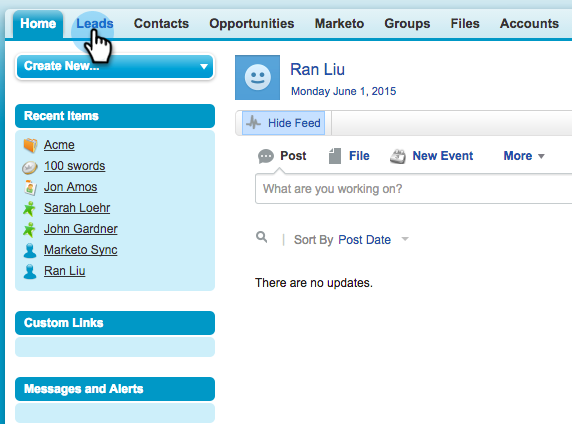

# 向[!DNL Marketo Sales Insight]中的多个记录发送电子邮件 {#send-an-email-to-multiple-records-in-marketo-sales-insight}

使用[!DNL Marketo Sales Insight]向多人发送Marketo电子邮件非常简单。 我们开始吧。

1. 在[!DNL Salesforce]中，单击&#x200B;**[!UICONTROL Leads]**&#x200B;或&#x200B;**[!UICONTROL Contacts]**。

   

1. 单击&#x200B;**[!UICONTROL Go]**&#x200B;查看所有打开的潜在客户。

   

1. 在列表视图中，检查要向其发送电子邮件的所有潜在客户/联系人，然后单击&#x200B;**[!UICONTROL Send Marketo Email (classic)]**。

   

   >[!NOTE]
   >
   >如果您使用的是[!DNL Salesforce Lightning]，则按钮将显示为&#x200B;**[!UICONTROL Send Marketo Email (lightning)]**。

   >[!TIP]
   >
   >没看到按钮吗？ 确保您已[将Marketo按钮添加到列表视图](/help/marketo/product-docs/marketo-sales-insight/msi-for-salesforce/configuration/add-bulk-action-buttons-to-salesforce-classic.md)。

1. 继续并撰写电子邮件。 完成后单击 **[!UICONTROL Send with Marketo]**。

   

   >[!TIP]
   >
   >您可以[将电子邮件发布到 [!DNL Sales Insight]](/help/marketo/product-docs/marketo-sales-insight/msi-for-salesforce/features/actions-in-the-msi-panel/send-marketo-email/publish-an-email-to-sales-insight.md)并从这些电子邮件中进行选择。

   >[!NOTE]
   >
   >一次最多可发送200封Marketo电子邮件。
