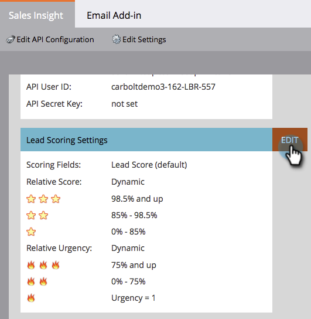

# 定制星光和火焰 {#customize-stars-and-flames}

Marketo Sales Insight使用星光和火焰来优先处理潜在客户。 Marketo自动决定谁能获得1-2-3颗星/火焰。 但是，您可以修改公式。 以下是操作方法：

>[!AVAILABILITY]
>
>并非所有客户都购买了此功能。 有关详细信息，请联系您的销售代表。

>[!NOTE]
>
>**需要管理员权限**

1. 在“管理员”下，单击 **销售分析**.

1. 在 **商机评分设置** ，单击 **编辑**.

   

1. 选择 **评分方法** 你选的。

   >[!NOTE]
   >
   >**条件**
   >
   >**动态**  — 是从 [相对数据](/help/marketo/product-docs/marketo-sales-insight/msi-for-salesforce/features/stars-and-flames/priority-urgency-relative-score-and-best-bets.md). 棒极了。 建议使用此方法。
   >
   >**静态**  — 允许您定义确切的分数数字 — 不再有百分比，不再有秘密的酱汁。

   

1. 根据您的喜好编辑百分比方括号，然后 **保存**.

   >[!TIP]
   >
   >只需编辑开始百分比，Marketo就会为您计算结束百分比！

   

>[!NOTE]
>
>一旦改变，重新计算恒星和火焰的过程将需要一些时间。 耐心是一种美德。

甜甜！ 您只是定制了Marketo计算明星和火焰的方式，以更好地满足您的业务需求。
