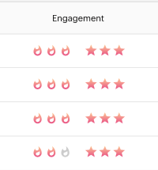

# 优先级、紧急性、相对得分和最佳赌注{#priority-urgency-relative-score-and-best-bets}

Marketo Sales Insight根据您的最佳潜在客户和联系人的优先级来挑选他们。 潜在客户或联系人的优先级包含两个组件 — 紧急性和相对得分。

这些积分源自潜在客户得分，即个人对您产品兴趣的度量。 分数越高，他们就越有可能对您销售团队打来的电话作出积极回应。

>[!NOTE]
>
>您需要多个评分活动才能获得优先级、紧急性和相对得分的完全值。  由于得分活动过少或没有，这些字段将不会有用。

## 紧急{#urgency}

火势表明了紧迫性 — 这个人的领先分数最近发生了多大变化。 高度紧迫（火势更大）意味着，这一线索的得分最近增加了很多；这个线索对你的优惠很感兴趣。 你应该尽快跟上他！

例如，某个潜在客户请求演示并访问了多个网页，可能会具有非常高的紧急性。 如果某个潜在客户没有访问您的网页或打开您的电子邮件，则其紧急程度较低。 使用紧急性，确定下一个需要联系的人的优先顺序。

## 相对得分{#relative-score}

星表示相对得分 — 衡量此人的潜在客户得分与其他人的得分。相对得分较高意味着此人与相对得分较低的人相比，可能对您的优惠更感兴趣并更了解您。

如果两个潜在客户具有相同的紧急情况，您可以使用相对得分来判断哪个潜在客户应该首先打电话。 相对得分较高的优惠对您的客户的反应可能比较低的客户更好。

## 最佳赌注{#best-bets}

您的最佳下注是具有最高紧急度和相对得分的潜在客户和联系人。 只有您拥有的潜在客户才会显示在该列表中，并且列表会随潜在客户分数的变化而更新。

>[!NOTE]
>
>如果您的最佳赌注与您拥有的最佳潜在客户和联系人不匹配，请与您公司中有权访问Marketo的人谈一谈有关更新[评分规则](/help/marketo/getting-started/quick-wins/simple-scoring.md)的信息。

### 如何计算紧急程度和相对得分

要计算星形和火焰的数量，首先将按得分或分数更改（分别针对相对得分和紧急程度）对您的潜在客户和联系人进行排序。 然后它们被分成几层 — 顶层得到的星星或火焰最多，下一层得到的更少，等等。

随着分数的变化，将立即重新计算紧急程度、优先级和相对分数值。 每晚在Marketo服务器上自动计算紧急程度和相对得分层。

>[!NOTE]
>
>“相对紧急（火焰）”和“相对得分（星号）”计数是Marketo中的整数。 每个值的可能值为0-3。
