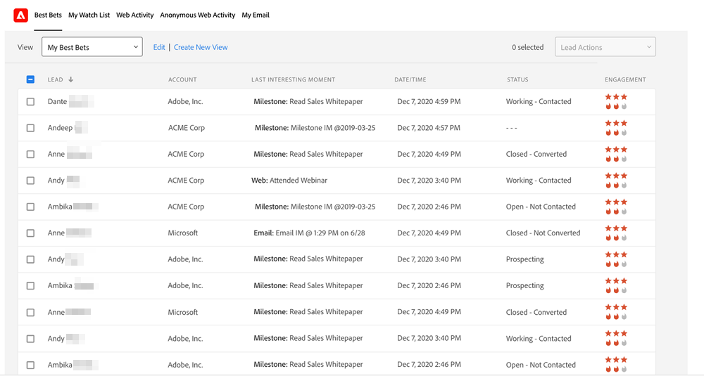

# 优先级、紧急性、相对得分和最佳押注 {#priority-urgency-relative-score-and-best-bets}

Marketo Sales Insight根据您的最佳潜在客户和联系人的优先级来挑选他们。 潜在客户或联系人的优先级有两个组成部分：紧急和相对分数。

这些量度源自潜在客户分数 — 衡量客户对您产品的兴趣。 分数越高，他们就越有可能对您销售团队的电话做出积极回应。

>[!NOTE]
>
>您需要多个评分营销活动，才能获得优先级、紧急性和相对得分的全部值。  由于打分的营销活动过少或没有打分，这些字段将不会有用。

## 紧急 {#urgency}

火焰代表着紧迫性 — 这个人的领先分数最近发生了多少变化。 高度紧迫（火势更大）意味着，这一铅的分数最近增加了很多；这个线索对你的提议感兴趣，这是个好兆头。 你应该尽快跟踪这人！

例如，如果某个潜在客户请求了演示并访问了多个网页，则该潜在客户可能会非常迫切。 没有访问您的网页或打开您的电子邮件的潜在客户，将没有那么紧迫。 请紧急安排下一个需要联系的人的优先顺序。

## 相对分数 {#relative-score}

星表示相对得分 — 衡量此人的领先得分与其他每个人的领先得分的对比情况。相对得分较高意味着此人与相对得分较低的人相比，可能更感兴趣并了解您的选件。

如果两个潜在客户具有相同的紧急情况，您可以使用相对分数来判断哪个潜在客户应该首先打电话。 相对得分较高的选件与相对得分较低的选件相比，对选件的反应更为积极。

## 最佳下注 {#best-bets}

您的最佳选择是您具有最高紧急度和相对分数的潜在客户和联系人。 只有您拥有的潜在客户才会显示在该列表中，并且该列表会随潜在客户分数的变化而更新。

>[!NOTE]
>
>如果您的最佳选择与您拥有的最佳潜在客户和联系人不匹配，请与您公司中有权访问Marketo的人员联系，以了解有关更新 [评分规则](/help/marketo/getting-started/quick-wins/simple-scoring.md).

### 如何计算紧急度和相对得分

要计算星星数和火焰数，您的潜在客户和联系人首先按分数或分数变化进行排序（分别针对相对分数和紧急情况）。 然后它们被分成几层 — 顶层会得到最多的恒星或火焰，下一层会得到更少的，等等。

随着分数的变化，将立即重新计算紧急程度、优先级和相对分数值。 每晚在Marketo服务器上自动计算紧急程度和相对得分层。

>[!NOTE]
>
>相对紧急（火焰）和相对得分（星形）计数是Marketo中的整数。 每个值的可能值为0-3。
