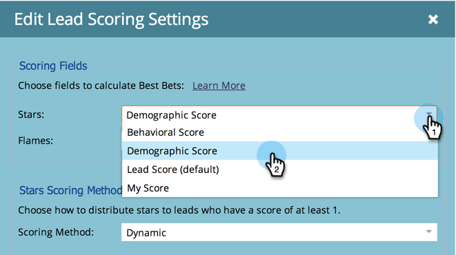
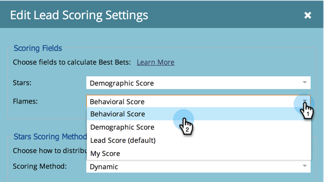

# 设置要在[!UICONTROL Stars]中用于[!UICONTROL Flames]和[!DNL Sales Insight]的分数字段 {#set-score-fields-to-be-used-for-stars-and-flames-in-sales-insight}

>[!NOTE]
>
>**需要管理员权限**

默认情况下，[!DNL Marketo Sales Insight]使用&#x200B;**[!UICONTROL Lead Score]**&#x200B;字段计算星星和火焰。 但是，如果您想选择其他字段，请执行以下操作：

>[!TIP]
>
>如果您还没有自定义得分字段，下面是如何[创建](/help/marketo/product-docs/administration/field-management/create-a-custom-field-in-marketo.md)这些字段。

>[!NOTE]
>
>**定义**
>
>* **[!UICONTROL Stars]**：星代表与其他潜在客户相比的潜在客户总分数。
>* **[!UICONTROL Flames]**：火焰代表紧迫性 — 商机分数最近发生了多少变化。
>

1. 在&#x200B;**[!UICONTROL Admin]**&#x200B;下，单击&#x200B;**[!UICONTROL Sales Insight]**。

   

1. 在&#x200B;**[!UICONTROL Lead Scoring Settings]**&#x200B;下，单击&#x200B;**[!UICONTROL Edit]**。

   

1. 选择要用于&#x200B;**[!UICONTROL Stars]**&#x200B;的字段。

   

1. 选择要用于&#x200B;**[!UICONTROL Flames]**&#x200B;的字段。

   

1. 单击 **[!UICONTROL Save]**。

   

   >[!NOTE]
   >
   >[!DNL Sales insight]需要一些时间来重新计算。 您可以稍后查看CRM以查看星星和火焰。

   >[!MORELIKETHIS]
   >
   >[优先级、紧迫性、相对分数和最佳匹配](/help/marketo/product-docs/marketo-sales-insight/msi-for-salesforce/features/stars-and-flames/priority-urgency-relative-score-and-best-bets.md)
