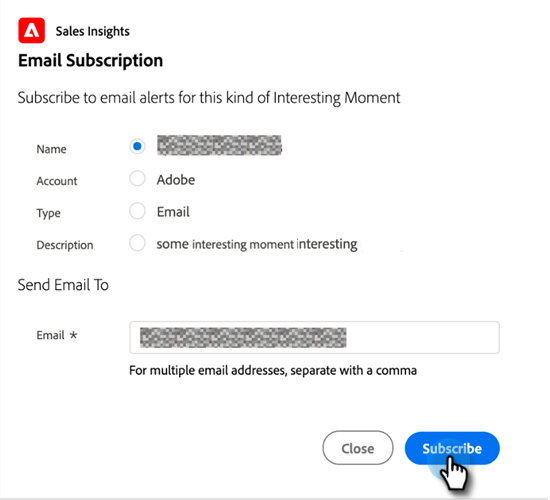

# 使用有趣的时刻 {#using-interesting-moments}

通过Marketo Sales Insight应用程序与您的销售团队进行沟通的关键时刻是有趣的时刻。

>[!AVAILABILITY]
>
>这些功能可用于Marketo Sales Insight和 [Marketo Sales Connect](/help/marketo/product-docs/marketo-sales-connect/marketo/interesting-moments-in-sales-connect.md) 仅限客户。

## 什么是有趣的时刻？ {#what-is-an-interesting-moment}

这取决于你！ 您决定与您的销售团队相关的信息。 您的销售团队可能希望了解商机的时间：

* 访问您网站上的定价页面
* 单击新产品公告电子邮件中的链接
* 请求产品演示

## 如何创造有趣的时刻？  {#how-do-i-create-an-interesting-moment}

1. 选择 [智能营销活动](/help/marketo/product-docs/core-marketo-concepts/smart-campaigns/understanding-smart-campaigns.md)，最好是您的销售团队在触发时会发现其中一个有趣。

   

1. 在 **有趣的时刻** 流步骤。

   

1. 选择 **type** （电子邮件、里程碑或Web）。

   

1. 在 **描述** 字段来解释此操作为何重要。

   

   >[!NOTE]
   >
   >Marketo还将添加发生的日期以及添加有趣时刻的方式（即，潜在客户操作>流步骤、SOAP API）。

## 这怎么会更有趣？  {#how-can-this-get-even-more-interesting}

令牌！ 在描述字段中添加这些参数，以向您的销售团队提供更具体的信息，例如潜在客户打开的电子邮件的主题行或发送者。 查看可在 [令牌表达有趣时刻](/help/marketo/product-docs/marketo-sales-insight/msi-for-salesforce/features/tabs-in-the-msi-panel/interesting-moments/trigger-tokens-for-interesting-moments.md) 术语表。

>[!TIP]
>
>从五个有趣的时刻开始，然后与您的销售团队合作，确定他们感兴趣看到的信息。

## 在Marketo，什么是有趣的时刻？  {#what-does-an-interesting-moment-look-like-in-marketo}

有趣的时刻将显示在 [潜在客户的活动日志](/help/marketo/product-docs/core-marketo-concepts/smart-lists-and-static-lists/managing-people-in-smart-lists/using-the-person-detail-page.md).

## 在Salesforce中，一个有趣的时刻是什么？  {#what-does-an-interesting-moment-look-like-in-salesforce}

一旦 [安装了Marketo Sales Insight应用程序](/help/marketo/product-docs/marketo-sales-insight/msi-for-salesforce/configuration/configure-marketo-sales-insight-in-salesforce-enterprise-unlimited.md)，则潜在客户、联系人、帐户或机会页面上会显示有趣的时刻。 它们还显示在“销售分析”功能板中的“潜在客户信息源”、“最佳预测”和“监视列表”中。

## 在Salesforce1中，有什么有趣的时刻？ {#what-does-an-interesting-moment-look-like-in-salesforce-1}

安装或更新Marketo Sales Insight for Salesforce1后，潜在客户的相关链接下将显示有趣的时刻。

## 订阅有趣的时刻 {#subscribe-to-interesting-moments}

您可以通过单击“关注时刻”选项卡或“潜在客户信息源”中的“订阅”按钮来订阅“关注时刻”。 对于这两个报表，以下步骤相同。

1. 单击订阅图标。 然后，您将导航到电子邮件订阅选项卡。

1. 您可以根据“名称”、“帐户”、“类型”或“描述”选择要接收的电子邮件警报类型。

1. 选择要向（您自己/团队成员）发送警报的电子邮件地址

1. 单击 **订阅**.

>[!NOTE]
>
>在订阅“感兴趣的时刻类型”或“描述”时，用户将收到针对其触发与“该类型”或“描述”匹配的“感兴趣的时刻”时拥有的人员（潜在客户/联系人）的电子邮件通知。

