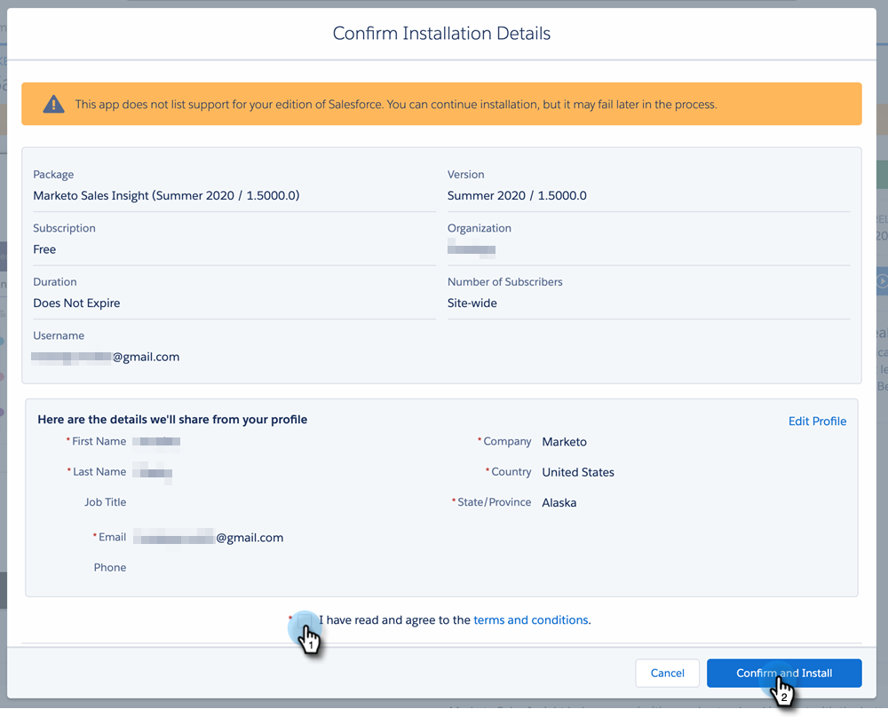
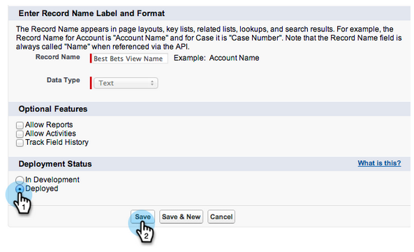

# 在SalesforceAppExchange中安装Marketo Sales Insight包 {#install-marketo-sales-insight-package-in-salesforce-appexchange}

您需要先在Salesforce订阅中安装Marketo Sales Insight应用程序，然后才能享受Sales Insight提供的所有好处。 这是方法。

>[!NOTE]
>
>**需要管理员权限**

>[!NOTE]
>
>Marketo Sales Insight与Salesforce Platform(Shield)Encryption兼容。

1. 转到 [Marketo Sales Insight的AppExchange页面](https://appexchange.salesforce.com/listingDetail?listingId=a0N30000001SVZmEAO) 单击 **立即获取**.

   

1. 单击 **登录AppExchange** 按钮，然后使用您的Salesforce凭据登录。

1. 输入连接的Salesforce帐户登录，然后单击 **在生产环境中安装**.

   

   >[!TIP]
   >
   >如果要先在沙盒中测试它，请选择 **在沙盒中安装**.

1. 阅读并接受条款和条件，然后单击 **确认和安装**.

   

1. 您可以选择“仅为管理员安装”（稍后提供对特定配置文件的MSI访问权限）、“为所有用户安装”或“为特定配置文件安装”。

   

1. 开始安装过程后，您可能会看到以下消息。 安装完成后，您将收到一封电子邮件。 单击 **完成** 解雇。

   

1. 验证 **Marketo Sales Insight** 在已安装的包中。

   

1. 单击 **设置** 在您的姓名旁边。

   

1. 搜索“对象”，然后单击 **对象** 在 **创建**.

   

1. 再次检查 **已部署** 将检查所有Marketo Sales Insight项目。

   

1. 如果未部署对象，请单击 **编辑** 项目旁边。

   

1. 在 **部署状态** 选择 **已部署**，然后单击 **保存**.

   

干得好！ 现在，您已安装并部署了Marketo Sales Insight。 继续为您的销售团队配置它，并观看销售飞天车。

>[!MORELIKETHIS]
>
>* [在Salesforce专业版中配置Marketo Sales Insight](/help/marketo/product-docs/marketo-sales-insight/msi-for-salesforce/configuration/configure-marketo-sales-insight-in-salesforce-professional-edition.md)
>* [在Salesforce企业/无限制中配置Marketo Sales Insight](/help/marketo/product-docs/marketo-sales-insight/msi-for-salesforce/configuration/configure-marketo-sales-insight-in-salesforce-enterprise-unlimited.md)
>* [向用户档案添加Sales Insight访问权限](/help/marketo/product-docs/marketo-sales-insight/msi-for-salesforce/configuration/add-sales-insight-access-to-profiles.md){target=&quot;_blank&quot;}

