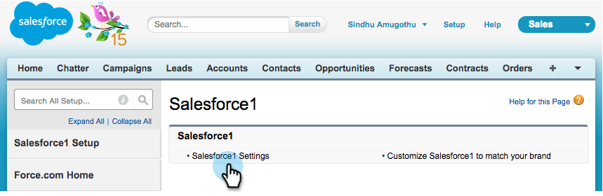

# 在Salesforce中安装和配置Marketo Sales Insight1 {#install-and-configure-marketo-sales-insight-in-salesforce}

>[!NOTE]
>
>请现有客户 [升级MSI包](/help/marketo/product-docs/marketo-sales-insight/msi-for-salesforce/upgrading/upgrading-your-msi-package.md) 在你继续之前！

>[!PREREQUISITES]
>
>如果您有Salesforce Enterprise/Unlimited:
>
>* [步骤1（共3步）：将Marketo字段添加到Salesforce（企业/无限制）](/help/marketo/product-docs/crm-sync/salesforce-sync/setup/enterprise-unlimited-edition/step-1-of-3-add-marketo-fields-to-salesforce-enterprise-unlimited.md)
>* [步骤2（共3步）：为Marketo创建Salesforce用户（企业/无限制）](/help/marketo/product-docs/crm-sync/salesforce-sync/setup/enterprise-unlimited-edition/step-2-of-3-create-a-salesforce-user-for-marketo-enterprise-unlimited.md)
>* [步骤3（共3步）：连接Marketo和Salesforce（企业/无限制）](/help/marketo/product-docs/crm-sync/salesforce-sync/setup/enterprise-unlimited-edition/step-3-of-3-connect-marketo-and-salesforce-enterprise-unlimited.md)
>* [在Salesforce企业/无限制中配置Marketo Sales Insight](/help/marketo/product-docs/marketo-sales-insight/msi-for-salesforce/configuration/configure-marketo-sales-insight-in-salesforce-enterprise-unlimited.md)
>
>如果您有Salesforce Professional:
>
>* [在Salesforce专业版中配置Marketo Sales Insight](/help/marketo/product-docs/marketo-sales-insight/msi-for-salesforce/configuration/configure-marketo-sales-insight-in-salesforce-professional-edition.md)
>

>[!NOTE]
>
>Marketo Salesforce1中的Sales Insight包括：最佳投注、商机信息源、有趣时刻以及添加到Marketo Campaign中。

## 启用Salesforce1移动设备应用程序 {#enable-the-salesforce1-mobile-app}

1. 单击 **设置** 然后 **移动设备管理**.

   

1. 单击 **Salesforce1**.

   

1. 单击 **Salesforce1设置**.

   

1. 单击 **启用Salesforce1移动浏览器应用程序**.

   

1. 单击 **保存**.

   

1. 选择 **移动设备管理**.

   

1. 单击 **管理移动设备导航菜单**.

   

1. 选择 **Marketo** 和 **添加** 它 **已选择** 菜单项。

   

1. 选择 **Marketo**，移动 **向上** ，然后单击 **保存**.

   

## 隐藏过时的Marketo自定义对象 {#hide-outdated-marketo-custom-object}

1. 单击 **设置**.

   

1. 选择 **管理用户**.

   

1. 选择 **用户档案**.

   

1. 单击 **编辑** 任何所需的用户档案。

   

1. 在 **选项卡设置**，选择 _第_ **Marketo**.

   

1. 选择 **隐藏选项卡**.

   

   >[!NOTE]
   >
   >确保隐藏所有所需用户档案的Marketo选项卡！

## 自定义选项卡 {#customize-tabs}

1. 单击 **+**.

   

1. 单击 **自定义我的选项卡**.

   

1. 选择 **Marketo** 和 **添加** 将其添加到“选定”选项卡。

   

1. 选择 **Marketo**，移动 **向上** ，然后单击 **保存**.

   

## 自定义页面布局 {#customize-page-layouts}

1. 单击 **设置**.

   

1. 单击 **设置**，类型 **页面布局**，然后单击 **页面布局** 潜在客户。

   >[!NOTE]
   >
   >对贵组织使用的每个页面布局（营销、销售等）重复执行这些步骤 （联系人、帐户和机会对象）。

   

1. 单击 **编辑** 以更改“潜在客户布局”。

   

1. 单击 **可视化强制页面** 然后拖动 **潜在客户移动设备** 转到“移动卡”部分。

   

1. 将“Height（高度）”更改为“66”，然后单击 **确定**.

   

1. 单击 **字段** 拖动 **添加到Marketo Campaign** 到 **Marketo Sales Insight** 中。

   

   >[!TIP]
   >
   >在快速查找中键入“添加到”，以便轻松查找添加到Marketo Campaign。

1. 单击 **保存**.

   

噢！ 您终于完成了Marketo Sales Insight for Salesforce1的安装！ 去拍拍自己的背。

>[!MORELIKETHIS]
>
>* [Salesforce中的最佳选择1](/help/marketo/product-docs/marketo-sales-insight/msi-for-salesforce/msi-for-mobile/best-bets-in-salesforce1.md)
>* [Salesforce中的有趣时刻1](/help/marketo/product-docs/marketo-sales-insight/msi-for-salesforce/msi-for-mobile/interesting-moments-in-salesforce1.md)
>* [在Salesforce中发送Marketo电子邮件和Campaign和Watchlist操作1](/help/marketo/product-docs/marketo-sales-insight/msi-for-salesforce/msi-for-mobile/send-marketo-email-and-campaign-and-watchlist-actions-in-salesforce1.md)

