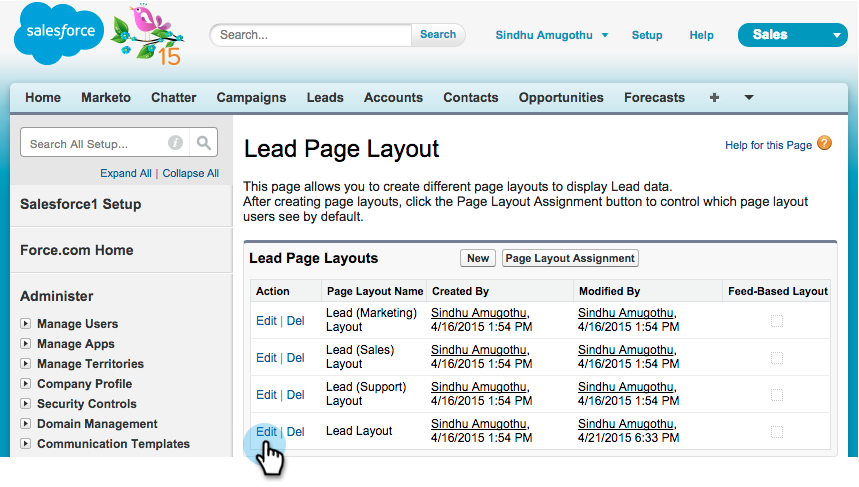

# 在Salesforce1 {#install-and-configure-marketo-sales-insight-in-salesforce}中安装和配置Marketo Sales Insight

>[!NOTE]
>
>**提醒**
>
>现有客户，请[升级您的MSI包](https://docs.marketo.com/x/_gU6Ag)，然后继续！

>[!PREREQUISITES]
>
>如果您有Salesforce企业/无限：
>
>* [第1步，共3步：将Marketo字段添加到Salesforce(Enterprise/Unlimited)](../../../../product-docs/crm-sync/salesforce-sync/setup/enterprise-unlimited-edition/step-1-of-3-add-marketo-fields-to-salesforce-enterprise-unlimited.md)
>* [第2步，共3步：为Marketo创建Salesforce用户(Enterprise/Unlimited)](../../../../product-docs/crm-sync/salesforce-sync/setup/enterprise-unlimited-edition/step-2-of-3-create-a-salesforce-user-for-marketo-enterprise-unlimited.md)
>* [第3步，共3步：Connect Marketo和Salesforce(Enterprise/Unlimited)](../../../../product-docs/crm-sync/salesforce-sync/setup/enterprise-unlimited-edition/step-3-of-3-connect-marketo-and-salesforce-enterprise-unlimited.md)
>* [在Salesforce Enterprise/Unlimited中配置Marketo Sales Insight](../../../../product-docs/marketo-sales-insight/msi-for-salesforce/configuration/configure-marketo-sales-insight-in-salesforce-enterprise-unlimited.md)

>
>
如果您有Salesforce Professional:
>
>* [在Salesforce专业版中配置Marketo Sales Insight](../../../../product-docs/marketo-sales-insight/msi-for-salesforce/configuration/configure-marketo-sales-insight-in-salesforce-professional-edition.md)

>

>[!NOTE]
>
>Salesforce1中的Marketo Sales Insight包括：最佳赌注、商机源、有趣时刻和添加到营销活动。

1. 启用Salesforce1移动应用程序
1. 单击&#x200B;**Setup**，然后单击&#x200B;**Mobile Administration**。

   

1. 单击&#x200B;**Salesforce1**。

   

1. 单击&#x200B;**Salesforce1设置**。

   

1. 单击&#x200B;**启用Salesforce1移动浏览器应用程序**。

   

1. 单击&#x200B;**保存**。

   

1. 选择&#x200B;**Mobile Administration**。

   

1. 单击&#x200B;**管理移动导航菜单**。

   

1. 选择**Marketo **和**将***它添加到**已选**菜单项。

   

1. 选择&#x200B;**Marketo**，将其**Up **移动到所需区域，然后单击&#x200B;**保存**。

   

1. 隐藏过时的Marketo自定义对象
1. 单击&#x200B;**Setup**。

   

1. 选择&#x200B;**管理用户**。

   

1. 选择&#x200B;**用户档案**。

   

1. 单击以**编辑**任何所需的用户档案。

   

1. 在&#x200B;**Tab Settings**&#x200B;下，选择&#x200B;*first* **Marketo**。

   ** 

   **

1. 选择&#x200B;**选项卡隐藏**。

   ** 

   **

   >[!NOTE]
   >
   >确保隐藏所有所需用户档案的“营销人员”选项卡！

1. 自定义选项卡
1. 单击** +**。

   

1. 单击&#x200B;**自定义我的选项卡**。

   

1. 选择&#x200B;**Marketo**&#x200B;并**将***它添加到选定选项卡。

   

1. 选择&#x200B;**Marketo**，将其**Up **移动到所需区域，然后单击&#x200B;**保存**。

   

1. 自定义页面布局
1. 单击&#x200B;**Setup**。

   

1. 单击“**设置**”，键入&#x200B;**页面布局**，然后单击“潜在客户”下的“**页面布局**”。

   >[!NOTE]
   >
   >为您的组织使用的每个页面布局（营销、销售等）重复执行这些步骤 Contact、Account和Opportunity对象。

   

1. 单击&#x200B;**编辑**&#x200B;以更改潜在客户布局。

   

1. 单击**Visualforce页面&#x200B;**，然后将** Lead Mobile **拖至“移动卡”部分。

   

1. 将“高度”更改为66，然后单击&#x200B;**确定**。

   

1. 单击&#x200B;**字段**，将**Add to Marketo活动&#x200B;**拖动到** Marketo Sales Insight **部分。

   

   >[!TIP]
   >
   >在“快速查找”中键入“添加到”，以便轻松查找“添加到营销活动”。

1. 单击&#x200B;**保存**。

   

噢！ 您终于完成了Salesforce1的Marketo Sales Insight安装！ 去吧，拍拍自己的背。

>[!MORELIKETHIS]
>
>* [Salesforce中的最佳赌注1](best-bets-in-salesforce1.md)
>* [Salesforce中有趣的时刻1](interesting-moments-in-salesforce1.md)
>* [在Salesforce1中发送Marketo电子邮件和活动和观察列表操作](send-marketo-email-and-campaign-and-watchlist-actions-in-salesforce1.md)

>

