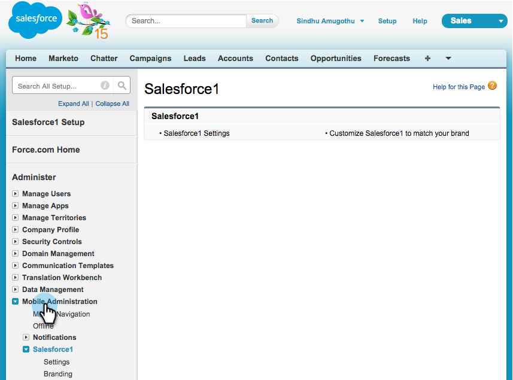
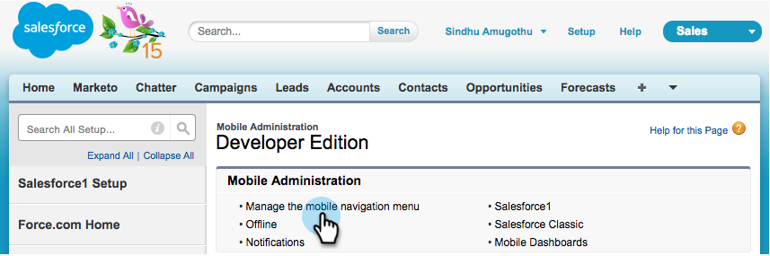

# 在Salesforce1中安装和配置Marketo Sales Insight {#install-and-configure-marketo-sales-insight-in-salesforce}

>[!NOTE]
>
>现有客户，请 [升级MSI包](/help/marketo/product-docs/marketo-sales-insight/msi-for-salesforce/upgrading/upgrading-your-msi-package.md) 然后再继续！

>[!PREREQUISITES]
>
>如果您拥有Salesforce Enterprise/Unlimited：
>
>* [第1步（共3步）：将Marketo字段添加到Salesforce (Enterprise/Unlimited)](/help/marketo/product-docs/crm-sync/salesforce-sync/setup/enterprise-unlimited-edition/step-1-of-3-add-marketo-fields-to-salesforce-enterprise-unlimited.md)
>* [第2步（共3步）：创建Marketo的Salesforce用户(Enterprise/Unlimited)](/help/marketo/product-docs/crm-sync/salesforce-sync/setup/enterprise-unlimited-edition/step-2-of-3-create-a-salesforce-user-for-marketo-enterprise-unlimited.md)
>* [第3步（共3步）：连接Marketo和Salesforce (Enterprise/Unlimited)](/help/marketo/product-docs/crm-sync/salesforce-sync/setup/enterprise-unlimited-edition/step-3-of-3-connect-marketo-and-salesforce-enterprise-unlimited.md)
>* [在Salesforce Enterprise/Unlimited中配置Marketo Sales Insight](/help/marketo/product-docs/marketo-sales-insight/msi-for-salesforce/configuration/configure-marketo-sales-insight-in-salesforce-enterprise-unlimited.md)
>
>如果您拥有Salesforce Professional：
>
>* [在Salesforce专业版中配置Marketo Sales Insight](/help/marketo/product-docs/marketo-sales-insight/msi-for-salesforce/configuration/configure-marketo-sales-insight-in-salesforce-professional-edition.md)
>

>[!NOTE]
>
>Salesforce1中的Marketo Sales Insight包括：最佳匹配、潜在客户源、有趣的时刻和添加到Marketo Campaign。

## 启用Salesforce1移动设备应用程序 {#enable-the-salesforce1-mobile-app}

1. 单击 **设置** 然后 **移动设备管理**.

   

1. 单击 **Salesforce1**.

   

1. 单击 **Salesforce1设置**.

   

1. 单击 **启用Salesforce1移动浏览器应用程序**.

   

1. 单击 **保存**.

   

1. 选择 **移动设备管理**.

   

1. 单击 **管理移动导航菜单**.

   

1. 选择 **Marketo** 和 **添加** 它到 **已选择** 菜单项。

   

1. 选择 **Marketo**，移动它 **向上** 到所需区域，然后单击 **保存**.

   

## 隐藏过期的Marketo自定义对象 {#hide-outdated-marketo-custom-object}

1. 单击 **设置**.

   

1. 选择 **管理用户**.

   

1. 选择 **配置文件**.

   

1. 单击 **编辑** 任何所需的配置文件。

   

1. 下 **选项卡设置**，选择 _第一_ **Marketo**.

   

1. 选择 **选项卡隐藏**.

   

   >[!NOTE]
   >
   >请确保为所有所需的配置文件隐藏Marketo选项卡！

## 自定义选项卡 {#customize-tabs}

1. 单击 **+**.

   

1. 单击 **自定义我的选项卡**.

   

1. 选择 **Marketo** 和 **添加** 将其添加到选定的选项卡。

   

1. 选择 **Marketo**，移动它 **向上** 到所需区域，然后单击 **保存**.

   

## 自定义页面布局 {#customize-page-layouts}

1. 单击 **设置**.

   

1. 单击 **设置**，类型 **页面布局**，然后单击 **页面布局** 在“潜在客户”下。

   >[!NOTE]
   >
   >对您的组织使用的每个页面布局（营销、销售等）重复这些步骤 对于Contact 、 Account和Opportunity对象。

   

1. 单击 **编辑** 以更改销售线索布局。

   

1. 单击 **Visualforce页面** 然后拖动 **潜在客户移动设备** 转到移动卡部分。

   

1. 将高度更改为66并单击 **确定**.

   

1. 单击 **字段** 并拖动 **添加到Marketo Campaign** 到 **Marketo Sales Insight** 部分。

   

   >[!TIP]
   >
   >在快速查找中键入“Add to”，以便轻松查找添加到Marketo Campaign的内容。

1. 单击 **保存**.

   

噢！ 您终于完成了Marketo Sales Insight for Salesforce1的安装！ 请拍拍自己的后背。

>[!MORELIKETHIS]
>
>* [Salesforce1中的最佳匹配](/help/marketo/product-docs/marketo-sales-insight/msi-for-salesforce/msi-for-mobile/best-bets-in-salesforce1.md)
>* [Salesforce1中的有趣时刻](/help/marketo/product-docs/marketo-sales-insight/msi-for-salesforce/msi-for-mobile/interesting-moments-in-salesforce1.md)
>* [在Salesforce1中发送Marketo电子邮件和Campaign及Watchlist操作](/help/marketo/product-docs/marketo-sales-insight/msi-for-salesforce/msi-for-mobile/send-marketo-email-and-campaign-and-watchlist-actions-in-salesforce1.md)
