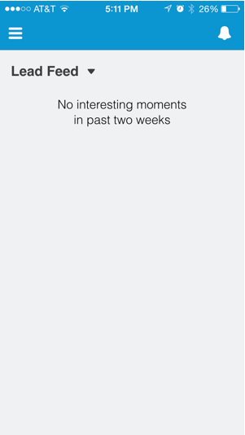

# 在Salesforce1中查看潜在客户馈送 {#seeing-lead-feed-in-salesforce}

潜在客户信息源是潜在客户开展的重要活动的最新列表。

1. 转到 **Marketo** 区域（在Salesforce1中）。

   

1. 点按向下箭头。

   

1. 点按 **商机馈送**.

   

   完美！ 现在您知道如何访问潜在客户信息源！

   

>[!MORELIKETHIS]
>
>* [Salesforce1中的有趣时刻](/help/marketo/product-docs/marketo-sales-insight/msi-for-salesforce/msi-for-mobile/interesting-moments-in-salesforce1.md)
>* [在Salesforce1中发送Marketo电子邮件、Campaign和Watchlist操作](/help/marketo/product-docs/marketo-sales-insight/msi-for-salesforce/msi-for-mobile/send-marketo-email-and-campaign-and-watchlist-actions-in-salesforce1.md)
>* [Salesforce1中的最佳匹配](/help/marketo/product-docs/marketo-sales-insight/msi-for-salesforce/msi-for-mobile/best-bets-in-salesforce1.md)
