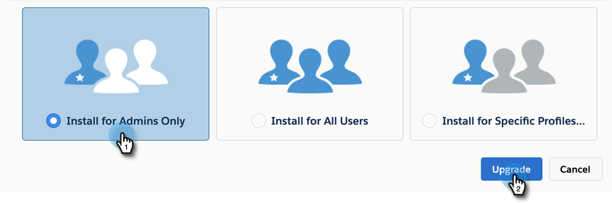

# 升级MSI包 {#upgrading-your-msi-package}

1. 在应用 [交换中导航到此页](http://appexchange.salesforce.com/listingDetail?listingId=a0N30000001SVZmEAO)。
1. 从步骤1的页面右上角登录到您的Salesforce实例（与Marketo实例连接的实例可以是沙箱或生产）。 您必须具有管理员权限才能在Salesforce中安装／升级受管理的包。
1. 单击“ **立即获取它** ”按钮。 系统将要求您选择要安装的位置。 由于您已拥有先前版本的MSI，因此您将可选择进行升级。 根据您在步骤1中登录的帐户选择选项。

   >[!TIP]
   >
   >我们建议您在升级生产实例之前在沙箱实例上测试它。

1. 您可以通过以下方式升级包：选择“仅限管理员安装”(稍后为特定用户档案提供MSI访问权限)、“为所有用户安装”或“为特定用户档案安装”。 在此示例中，我们选择“仅管理员”。 做出选择后，单击“升 **级”**。

   

