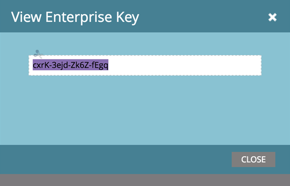

# 使用企业密钥{#install-the-marketo-add-in-for-outlook-with-an-enterprise-key}安装Outlook的Marketo Add-in

很多时候，销售代表在他们的笔记本电脑上没有管理权限，他们的IT团队负责远程安装所有软件。 Outlook的Marketo Add-in可以使用您的企业密钥以这种方式安装，该密钥位于管理员的“销售分析”部分。

>[!PREREQUISITES]
>
>管理员必须拥有[颁发的Marketo Email Add-In许可证](/help/marketo/product-docs/marketo-sales-insight/msi-outlook-plugin/issue-a-marketo-email-add-in-license.md)。

>[!NOTE]
>
>如果看不到“视图企业键”按钮，请联系[Marketo Support](https://nation.marketo.com/t5/Support/ct-p/Support)以启用它。

1. 在My Marketo中，单击&#x200B;**管理**，然后单击&#x200B;**销售分析**。

   

1. 单击&#x200B;**电子邮件插件**&#x200B;选项卡。

   

1. 单击&#x200B;**视图Enterprise Key**。

   

1. 复制Outlook企业许可证密钥并将其粘贴到电子邮件中，并将其与[此链接](/help/marketo/product-docs/marketo-sales-insight/msi-outlook-plugin/marketo-outlook-plugin-installation-by-it.md)一起粘贴，然后将其发送到您的IT部门进行远程安装。

   

   仅此而已！ 接下来，销售代表将完成[注册过程](/help/marketo/product-docs/marketo-sales-insight/msi-outlook-plugin/authorize-the-marketo-outlook-plugin.md)。
