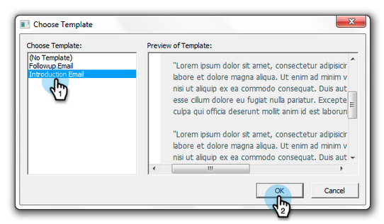

# 使用Marketo模板{#send-and-track-from-outlook-using-a-marketo-template}从Outlook发送和跟踪

如果您的营销团队已经向您提供了模板，那么在编写电子邮件时，您可以使用模板来节省时间。

1. 打开Microsoft Outlook，然后单击&#x200B;**Marketo Message**。

   

1. 选择所需的模板，预览它，然后单击&#x200B;**确定**。

   

1. 进行所有编辑，然后单击&#x200B;**发送并跟踪**。

   

   >[!NOTE]
   >
   >插件不支持令牌。 删除模板中可能包含的所有内容。

1. 查看预览，确保其显示良好，然后单击&#x200B;**发送**。

   

   就这样！ 您能够使用您超棒的营销团队为您打造的模板节省大量时间。

>[!MORELIKETHIS]
>
>[在Marketo中记录来自Lead的入站邮件](/help/marketo/product-docs/marketo-sales-insight/using-msi/log-inbound-mail-from-your-leads-in-marketo.md)
