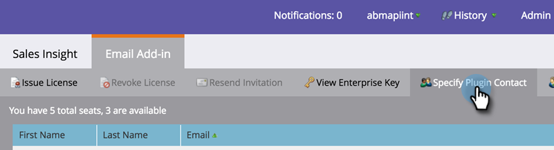
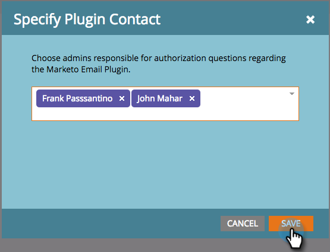

# 指定Marketo [!UICONTROL Sales Insight]插件管理员 {#specify-marketo-sales-insight-plugin-admins}

当邀请用户在[!DNL Outlook]上设置MSI时，您可以指定希望在发送给用户的电子邮件通知中显示的联系人。

1. 在“我的Marketo”中，单击&#x200B;**[!UICONTROL Admin]**，然后单击&#x200B;**[!UICONTROL Sales Insight]**。

   

1. 单击 **[!UICONTROL Email Add-In]** 选项卡。

   

1. 单击 **[!UICONTROL Specify Plugin Contact]**。

   

1. 单击以指定插件联系人。

   

1. 单击 **[!UICONTROL Save]**。

   

1. 您选择的联系人将列在销售代表在授权过程中收到的电子邮件中。

   

   完美！
