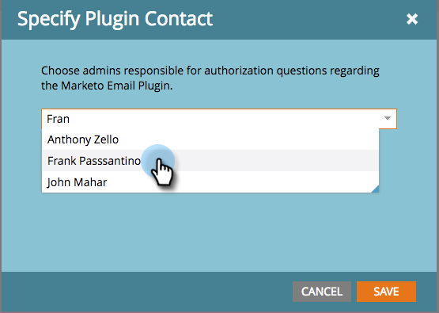

# 指定Marketo Sales Insight插件管理员 {#specify-marketo-sales-insight-plugin-admins}

您可以指定在邀请用户在Outlook中设置MSI时，要在发送给用户的电子邮件通知中显示哪些联系人。

1. 在我的Marketo中，单击 **管理员** 然后 **销售分析**.

   

1. 单击 **电子邮件加载项** 选项卡。

   

1. 单击 **指定插件联系人**.

   

1. 单击以指定插件联系人。

   

1. 单击 **保存**.

   

1. 您选择的联系人将列在授权过程中收到的电子邮件销售代表中。

   

   完美！
