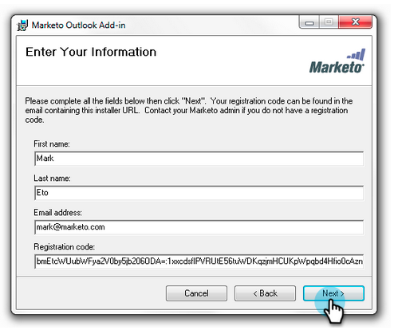

# 升级Outlook {#upgrade-your-marketo-email-add-in-for-outlook}的Marketo Email Add-In

当Outlook的Marketo Email Add-in有新版本时，请按照以下说明进行升级。

>[!NOTE]
>
>截至10/1/20，最新版Outlook插件不再支持脱机模式。 此操作将在10/1或之后安装/升级后生效。

## 下载安装程序{#download-installer}

下载适合您的Microsoft Outlook版本的安装程序。

<table> 
 <colgroup> 
  <col> 
  <col> 
  <col> 
  <col> 
  <col> 
 </colgroup> 
 <tbody> 
  <tr> 
   <th> </th> 
   <th colspan="2">单用户邀请安装</th> 
   <th colspan="2">企业密钥安装</th> 
  </tr> 
  <tr> 
   <td><strong>Outlook版本</strong></td> 
   <td><strong>32位</strong></td> 
   <td><strong>64位</strong></td> 
   <td><strong>32位</strong></td> 
   <td><strong>64位</strong></td> 
  </tr> 
  <tr> 
   <td>Outlook 2000</td> 
   <td>不支持</td> 
   <td>N/A</td> 
   <td>不支持</td> 
   <td>N/A</td> 
  </tr> 
  <tr> 
   <td>Outlook 2003</td> 
   <td><a href="https://munchkin.marketo.net/MarketoAddInSetup32.msi" rel="nofollow">下载</a></td> 
   <td>N/A</td> 
   <td>不支持</td> 
   <td>N/A</td> 
  </tr> 
  <tr> 
   <td>Outlook 2007</td> 
   <td><a href="https://munchkin.marketo.net/MarketoAddInSetup32.msi" rel="nofollow">下载</a></td> 
   <td>N/A</td> 
   <td>不支持</td> 
   <td>N/A</td> 
  </tr> 
  <tr> 
   <td>Outlook 2010</td> 
   <td><a href="https://munchkin.marketo.net/MarketoAddInSetup32.msi" rel="nofollow">下载</a></td> 
   <td><a href="https://munchkin.marketo.net/MarketoAddInSetup64.msi" rel="nofollow">下载</a></td> 
   <td><a href="https://munchkin.marketo.net/MarketoAddInSetup32.msi" rel="nofollow">下载</a></td> 
   <td><a href="https://munchkin.marketo.net/MarketoAddInSetup64.msi" rel="nofollow">下载</a></td> 
  </tr> 
  <tr> 
   <td>2013年展望</td> 
   <td><a href="https://munchkin.marketo.net/MarketoAddInSetup32.msi" rel="nofollow">下载</a></td> 
   <td><a href="https://munchkin.marketo.net/MarketoAddInSetup64.msi" rel="nofollow">下载</a></td> 
   <td><a href="https://munchkin.marketo.net/MarketoAddInSetup32.msi" rel="nofollow">下载</a></td> 
   <td><a href="https://munchkin.marketo.net/MarketoAddInSetup64.msi" rel="nofollow">下载</a></td> 
  </tr> 
  <tr> 
   <td>Outlook 2016</td> 
   <td><a href="https://munchkin.marketo.net/MarketoAddInSetup32.msi" rel="nofollow">下载</a></td> 
   <td><a href="https://munchkin.marketo.net/MarketoAddInSetup64.msi" rel="nofollow">下载</a></td> 
   <td><a href="https://munchkin.marketo.net/MarketoAddInSetup32.msi" rel="nofollow">下载</a></td> 
   <td><a href="https://munchkin.marketo.net/MarketoAddInSetup64.msi" rel="nofollow">下载</a></td> 
  </tr> 
  <tr> 
   <td colspan="1">《2019年展望》</td> 
   <td colspan="1"><a href="https://munchkin.marketo.net/MarketoAddInSetup32.msi" rel="nofollow">下载</a></td> 
   <td colspan="1"><a href="https://munchkin.marketo.net/MarketoAddInSetup64.msi" rel="nofollow">下载</a></td> 
   <td colspan="1"><a href="https://munchkin.marketo.net/MarketoAddInSetup32.msi" rel="nofollow">下载</a></td> 
   <td colspan="1"><a href="https://munchkin.marketo.net/MarketoAddInSetup64.msi" rel="nofollow">下载</a></td> 
  </tr> 
  <tr> 
   <td>Outlook for Mac</td> 
   <td>不支持</td> 
   <td>不支持</td> 
   <td>不支持</td> 
   <td>不支持</td> 
  </tr> 
  <tr> 
   <td colspan="1">Outlook Web应用程序</td> 
   <td colspan="1">不支持</td> 
   <td colspan="1">不支持</td> 
   <td colspan="1">不支持</td> 
   <td colspan="1">不支持</td> 
  </tr> 
  <tr> 
   <td colspan="1">Office 365*</td> 
   <td colspan="1"><a href="https://munchkin.marketo.net/MarketoAddInSetup32.msi" rel="nofollow">下载</a></td> 
   <td colspan="1"><a href="https://munchkin.marketo.net/MarketoAddInSetup64.msi" rel="nofollow">下载</a></td> 
   <td colspan="1"><a href="https://munchkin.marketo.net/MarketoAddInSetup32.msi" rel="nofollow">下载</a></td> 
   <td colspan="1"><a href="https://munchkin.marketo.net/MarketoAddInSetup64.msi" rel="nofollow">下载</a></td> 
  </tr> 
 </tbody> 
</table>

*Office 365版本：仅限Windows客户端（在Windows 10、Enterprise或Pro上）。

## 升级{#upgrade}

1. 识别您的[Microsoft Outlook版本](https://support.microsoft.com/en-us/office/what-version-of-outlook-do-i-have-b3a9568c-edb5-42b9-9825-d48d82b2257c?ui=en-us&amp;rs=en-us&amp;ad=us)。

1. 从上面的列表中选择您的版本。

1. 运行安装程序。

   

1. 单击&#x200B;**下一步**。

   

   >[!NOTE]
   >
   >在某些情况下，数据将丢失。 从注册电子邮件中复制它，然后关闭Outlook。

1. 关闭Microsoft Outlook。

   

1. 您会注意到您的所有信息都已预填。 只需单击&#x200B;**下一步**。

   

   >[!TIP]
   >
   >如果安装失败，请与您的IT部门合作，以确保HTTPS通信不被阻止。 安装程序需要打开HTTPS通信。

1. 单击&#x200B;**下一步**&#x200B;以在默认位置安装。

   

1. 单击&#x200B;**下一步**。

   

1. 安装现已完成。 单击&#x200B;**关闭**。

   

1. 现在打开Microsoft Outlook以查看最新版的Marketo按钮。

   

>[!MORELIKETHIS]
>
>* [使用Outlook的Marketo Email Add-in发送和跟踪电子邮件](/help/marketo/product-docs/marketo-sales-insight/msi-outlook-plugin/send-and-track-an-email-with-the-email-add-in-for-outlook.md)
>* [使用Marketo模板从Outlook发送和跟踪](/help/marketo/product-docs/marketo-sales-insight/msi-outlook-plugin/send-and-track-from-outlook-using-a-marketo-template.md)

