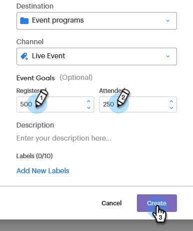

# 设置事件目标 {#setting-event-goals}

为事件指定特定目标并查看其效果。

>[!IMPORTANT]
>并非所有客户都购买了此功能。 有关详细信息，请联系您的客户成功经理。

1. 创建事件程序。

   

1. 为您的活动提供一个 [!UICONTROL Name]，选择 [!UICONTROL Destination] 文件夹和 [!UICONTROL Channel].

   

1. 输入目标 [!UICONTROL Registered] 和 [!UICONTROL Attended]，然后单击 **[!UICONTROL Create]** ([!UICONTROL Description] 和 [!UICONTROL Labels] 为可选)。

   

就这样！ 单击 [!UICONTROL Reports] 选项卡。
