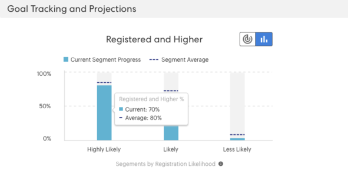

# 了解目标跟踪和预计注册 {#understanding-goal-tracking-and-projected-registrations}

之后 [设置事件目标](/help/marketo/product-docs/marketo-sky/setting-event-goals.md) 通过 [智能营销活动](/help/marketo/product-docs/core-marketo-concepts/smart-campaigns/creating-a-smart-campaign/create-a-new-smart-campaign.md)，下面介绍如何跟踪目标进度并了解Marketo的预测。

>[!NOTE]
>
>在Marketo Classic中创建事件程序时，事件开始日期当前默认为事件创建日期。 由于预计的注册考虑事件开始日期之前的时间，因此如果开始日期和创建日期相同，则这些数字可能不准确（除非特意设置）。

## 目标跟踪和预计注册 {#goal-tracking-and-projected-registrations}

1. 您可以在 **[!UICONTROL Reports]** 选项卡。 在这一具体例子中，到目前为止有150名注册成员，而目标是200(75%)。

   

您还将看到 **[!UICONTROL Projected]** 注册。 将鼠标悬停在信息图标上，可查看按似然区段划分的此数字。

>[!NOTE]
>
>在活动召开之前，已出席和较高级别的图表将保持为空。

1. 单击图表切换开关以按注册可能性切换到成员的划分。 您将看到每个区段的当前注册百分比，而该区段在您的过去项目中的平均百分比。

   

所有成员（已注册且尚未注册）均根据其注册可能性进行分类。 将鼠标悬停在信息图标上可查看如何定义这些可能性类别。

>[!NOTE]
>
>在事件发生前的每24小时更新一次预测数量。 列为 _处理_ 将包含在下一个计算周期中。

## 类似程序 {#similar-programs}

您可以通过查看过去类似程序的执行情况，对当前事件进行一些分析。 此部分显示过去6个月内最多5个类似计划，其成员数量/百分比为 _已注册_ 或更高版本。

在计算类似程序时，我们包括以下因素：

* 程序类型
* 节目渠道
* 受众规模
* 程序标记
* 从事件创建到事件开始的持续时间
* 事件持续时间

   

## 推荐 {#recommendations}

在“报表”页面顶部，您可以根据进度找到AI/ML驱动的推荐。 请定期回访，以获取有用的提示和洞察！

## 人员级别预测 {#person-level-predictions}

单击 **[!UICONTROL Members]** 选项卡来查看所有项目成员。 将鼠标悬停在 **[!UICONTROL Registration Likelihood]** 或 **[!UICONTROL Attendance Likelihood]** 栏以查看确切百分比和分类。 然后，您可以对特定类别中的成员（例如，“不太可能”中的每个成员注册类别）采取操作，并特别针对他们以潜在地增加您的注册数量。

>[!NOTE]
>
>个人可能性会考虑40多个人员因素，包括用户档案属性、人员活动以及以往受邀/注册/参加的活动。

## 常见问题解答 {#faq}

**问：什么是区段？**

答：可能要注册的值介于0到100之间。 每个是事件项目成员的人都会获得0到100之间的可能性值。

我们将似然值放入三个区段中：

* 注册的可能性>50% =极有可能的区段
* 注册的可能性>25%到&lt;50% =可能的区段
* 注册的可能性&lt;25% =可能性较低的区段

当某人有可能注册时，该预测将属于这些区段之一（每个项目成员都属于其中一个区段）。 例如，如果一个事件程序具有基于似然预测的1000个成员，则这1000个成员将分配到 _极有可能_, _可能_&#x200B;或 _不太可能_ 区段。

因此，属于“极有可能性”区段的人员注册该活动的机率更高。

转换为注册=区段中注册的人数除以属于该区段的人数（例如，如果100人属于“极有可能”区段，而其中60人属于注册，则转化率为60%）。

要注册的转化%将遵循以下模式：极可能性>可能性>极小可能性。

**问：如何使用这些分析？**

答：最佳做法包括：

i.您创建一个项目，然后智能营销活动使用“大于X”的预测过滤器，这将导致一定数量的人员（例如1000人）运行营销活动。

ii. 24小时后， [!UICONTROL Reports] 选项卡，您可以查看根据登记当前受邀人员值的可能性计算出的预计注册。

三。 如果预计的注册数低于目标值，则必须邀请更多人员。 此时，您可以看到一些洞察信息，告诉您过去的项目中哪个阈值有效。

四。 您可以使用该阈值创建新的智能营销活动，以邀请更多人。

v.如果您想在任何时间点了解显示预计数字的原因，可以切换查看跨区段的受众分布、过去的转化率，并将这些转化率应用到当前受众（请参阅下面的屏幕截图）。

**问：什么是“按注册划分的区段”图？**

答：三个条，每个条代表一个区段（极有可能、极可能、极不可能）。

**紫色虚线：** 该区段中注册的平均对话率（基于过去的类似程序）。

**蓝色条：** 该区段中所有人员的注册百分比。

例如，假设100人有可能注册超过50%，而在100人中，有60人可能注册。 极有可能发生60%的转化。 因此，添加到程序的所有成员都获得注册值的可能性，然后将它们放入区段中，并根据每个区段转化率中注册的人数计算它们。

**问：“已注册”和“更高”是什么意思？**

答：列为已注册的人员，或具有等于或更高步骤号的任何其他状态的人员。

您可以为事件程序创建新的晋升状态，但我们会将这些状态映射为标准状态。 假设某人从受邀转到被提醒，这比注册要高。 此人员还将被视为已注册并显示在目标跟踪中。

**问：如何计算预计的注册量？**

答：请参阅下文。

