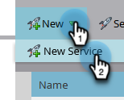

# 将 Vibes 添加为 LaunchPoint 服务 {#add-vibes-as-a-launchpoint-service}

您可以向选择加入访客短信营销活动的用户发送短信消息，从而利用短信活动在Marketo Engage实例中导航触发和过滤营销活动。 首先，您需要将Vibes添加为LaunchPoint服务。

>[!NOTE]
>
>**需要管理员权限**

>[!AVAILABILITY]
>
>您必须具有活动的Vibes帐户以及Vibes SMS的Adobe许可证。 Marketo Vibes SMS原生集成在美国和加拿大提供。 对于其他国家/地区，可以通过[直接联系Vibes](https://www.vibes.com/talk-to-sales){target="_blank"}来利用通过Marketo Webhook的连接。

1. 在“我的Marketo”中，转到&#x200B;**[!UICONTROL Admin]**&#x200B;区域。

   

1. 单击 **[!UICONTROL LaunchPoint]**。

   

1. 单击&#x200B;**[!UICONTROL New]**，然后单击&#x200B;**[!UICONTROL New Service]**。

   

1. 输入显示名称，然后在下拉列表中选择&#x200B;**[!UICONTROL Vibes]**。

   

1. 在“设置”下，输入您的Vibes [!UICONTROL Username]、[!UICONTROL Password]和[!UICONTROL Company Key]（所有这些都可以在您的Vibes帐户中找到）。 单击 **[!UICONTROL Create]**。

   

   新的短信服务现在出现在[!UICONTROL Installed Services]列表中。

   

>[!MORELIKETHIS]
>
>[Vibes视频演示](https://vimeo.com/215233767/1ed136adbc){target="_blank"}
