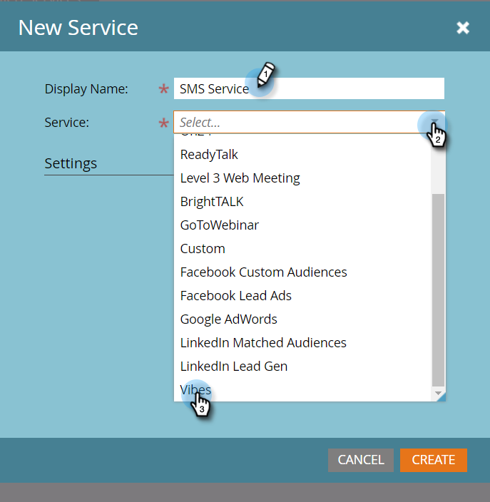

# 将Vibes添加为LaunchPoint服务 {#add-vibes-as-a-launchpoint-service}

您可以向访客列表中的人员发送短信消息，并使用短信活动触发和筛选营销活动。 首先，您需要将Vibes添加为LaunchPoint服务。

>[!NOTE]
>
>**需要管理员权限**

>[!NOTE]
>
>您需要Marketo管理员权限和活动的Vibes帐户才能完成此设置。 下面步骤4中请求的凭据是来自您的Vibes帐户的凭据。

1. 在“我的Marketo”中，单击 **管理员** 然后 **启动点**.

   

1. 单击 **新** 和 **新服务**.

   

1. 输入显示名称，然后在下拉列表中选择 **Vibes**.

   

1. 在“设置”下，输入您的Vibes用户名、密码和API公司密钥。 单击&#x200B;**创建**。

   

   新的SMS服务现在显示在Installed Services列表中。

   
