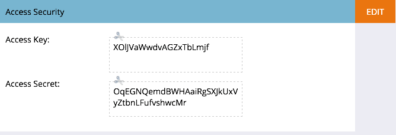

# 验证移动访问安全性 {#authenticate-mobile-access-security}

为了提高移动设备用户的安全性，Marketo提供了两个新的ID：访问密钥和访问密钥。 这些功能有助于确保登录到您应用程序的用户是真实用户。

要启用ID，您需要获取代码并将其提供给您的IT部门，以便他们能够设置安全匹配。

>[!PREREQUISITES]
>
>要启用此功能，请联系支持部门并请求“Vespa安全模式”。

1. 在Marketo中，选择 **管理员** 并单击 **移动应用程序和设备**.

   

1. 选择要为其启用安全访问的移动设备应用程序。

   

1. 向下滚动，在Access Security部分中，单击 **编辑**.

   

1. 查看 **启用安全性** 复选框。 单击 **保存**.

   

1. Access Security区域现在显示两个新代码。 请务必将这些文件发送给您的IT部门。

   
