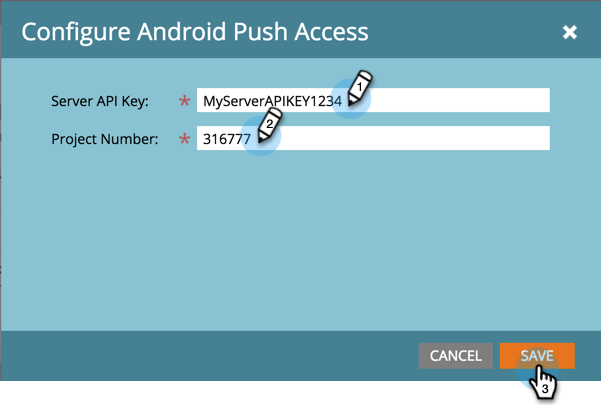

# 配置移动应用程序 Android 推送访问 {#configure-mobile-app-android-push-access}

1. 单击 **[!UICONTROL Admin]**。

   

1. 选择 **[!UICONTROL Mobile Apps]**。

   

1. 选择所需的移动设备应用程序。

   

1. 在 **[!UICONTROL Push Access Type]** 下，选择 **[!UICONTROL Android]** 并点击 **[!UICONTROL Configure]**。

   

   >[!NOTE]
   >
   >您需要来自移动应用开发人员的&#x200B;**[!UICONTROL Server API Key]**&#x200B;和&#x200B;**[!UICONTROL Project Number]**。 开发人员通过登录到[!DNL Google Play Developer Console]来接收这些内容，以注册您的应用程序并启用云消息。

1. 输入您的[!UICONTROL Server API Key]和[!UICONTROL Project Number]。 单击 **[!UICONTROL Save]**。

   

   真贴心。 确保使用[!UICONTROL iOS]配置应用程序。

>[!MORELIKETHIS]
>
>[配置移动应用程序iOS推送访问](/help/marketo/product-docs/mobile-marketing/admin/configure-mobile-app-ios-push-access.md)
