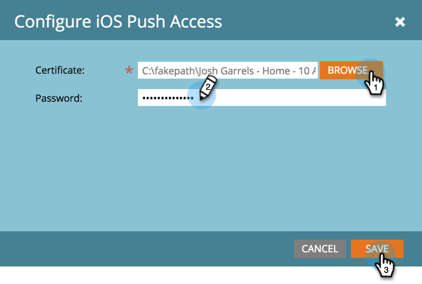

# 配置移动设备应用程序iOS推送访问 {#configure-mobile-app-ios-push-access}

1. 单击 **管理员**.

   

1. 选择 **移动设备应用程序**.

   

1. 选择所需的移动设备应用程序。

   

1. 在推送访问类型下，选择iOS并单击 **配置**.

   

   >[!NOTE]
   >
   >您需要 **证书** 和 **密码** 移动设备应用程序开发人员提供的信息。 开发人员通过登录Apple开发人员会员中心，为您的应用程序设置和下载推送通知证书，以及导出内容来接收这些证书。 开发人员在导出时设置密码。 **重要信息**:证书应适用于您所使用的环境类型（沙盒或生产）。 请通过Marketo管理员或移动设备应用程序开发人员来验证此信息。

1. 选择您的证书，输入您的密码，然后单击 **保存**.

   

干得好！ 另外，请确保您还使用Android配置应用程序。

>[!MORELIKETHIS]
>
>[配置移动设备应用程序Android推送访问](/help/marketo/product-docs/mobile-marketing/admin/configure-mobile-app-android-push-access.md)
