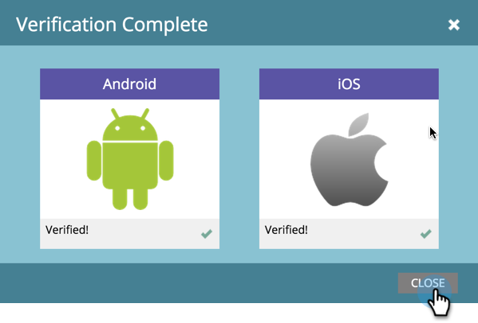

# 验证推送配置 {#verify-push-configuration}

>[!PREREQUISITES]
>
>您的移动设备开发人员必须已将Marketo的SDK代码添加到您的移动设备应用程序。

验证推送配置，以确保所有内容都能很好地同步。

1. 单击 **管理员**.

   

1. 选择 **移动设备应用程序**.

   

1. 选择所需的移动设备应用程序。

   

1. 单击 **移动设备应用程序操作** 选择 **验证推送配置**.

   

1. 确认已验证所需平台，然后单击 **关闭**.

   

一切就绪！ 现在，您可以开始发送推送通知。

>[!MORELIKETHIS]
>
>[创建推送通知](/help/marketo/product-docs/mobile-marketing/push-notifications/create-a-push-notification.md)
