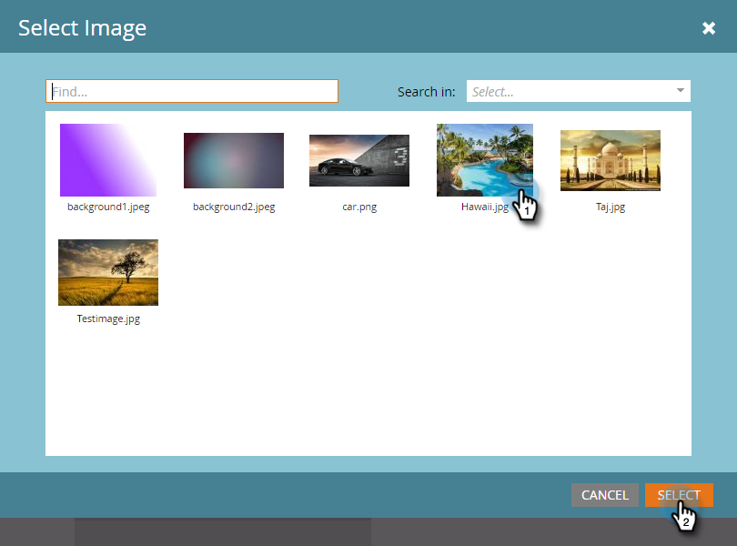

# 添加应用程序内消息图像 {#add-in-app-message-images}

您可以在此处选择和自定义应用程序内消息图像。

1. 选择应用程序内消息并单击 **编辑草稿**.

   

1. 在“布局”选项卡上，从六个模板中选择一个。 有三个弹出窗口和三个全屏选项。

   >[!TIP]
   >
   >模板之间有何区别？ 请参阅 [为应用程序内消息选择布局](/help/marketo/product-docs/mobile-marketing/in-app-messages/creating-in-app-messages/choose-a-layout-for-your-in-app-message.md) 开始之前。

   

1. 单击 **样式** 选项卡上，单击模板的图像区域。

   

1. 单击 **选择图像**.

   

1. 从Design Studio中选择您的图像，然后单击 **选择**.

   

   >[!NOTE]
   >
   >图像大小限制为1440 x 2560像素和5MB。

1. 改变主意，想要使用不同的图像？ 没问题。 单击 **X** 图像文件名旁边。

   

1. 单击 **删除**. 现在，你可以再选一个。

   

1. 在图像属性中，选择按高度、宽度或两者来调整图像大小的按钮，以将所需图像放置到适当位置。

   

1. （可选）应用图像边框。 默认设置为 **关闭**. 首先，通过单击颜色或在拾色器中输入十六进制或RGB编号来选择颜色。

   

1. 单击箭头可更改边框宽度（以像素为单位）。 你会在图像上看到它变化。

   

1. 使用滑块选择角半径。 从左到右选择一个位置：0、4、8、12或16像素。 默认为8像素（中心）选择。

   

1. 选择边距（开或关）。 **开** 是默认设置。

   

1. 选中框以定义图像点按操作。

   

1. 每个平台都有单独的操作（请参阅注意）。

   

1. 单击每个下拉菜单以显示选项。 选择一个。

   

   >[!NOTE]
   >
   >要点按图像、按钮或背景的操作，您可以为Apple和Android平台设置不同的操作。 例如，在Apple和Android中，深层链接的处理方式不同。 如果消息仅发送到一个平台或另一个平台，请将另一个平台保留在默认设置中，或选择 **无**.

干得好！ 现在，是时候 [为应用程序内消息创建文本](/help/marketo/product-docs/mobile-marketing/in-app-messages/creating-in-app-messages/create-in-app-message-text.md).

>[!MORELIKETHIS]
>
>* [了解应用程序内消息](/help/marketo/product-docs/mobile-marketing/in-app-messages/understanding-in-app-messages.md)
>* [为应用程序内消息选择布局](/help/marketo/product-docs/mobile-marketing/in-app-messages/creating-in-app-messages/choose-a-layout-for-your-in-app-message.md)

