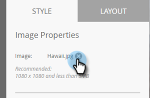

# 添加应用程序内消息图像 {#add-in-app-message-images}

您可以在此处选择和自定义应用程序内消息图像。

1. 选择应用程序内消息并单击 **编辑草稿**.

   

1. 在“布局”选项卡中选择六个模板之一。 有三个弹出窗口和三个全屏选项。

   >[!TIP]
   >
   >模板之间有何区别？ 参见 [选择应用程序内消息的布局](/help/marketo/product-docs/mobile-marketing/in-app-messages/creating-in-app-messages/choose-a-layout-for-your-in-app-message.md) 在开始之前。

   

1. 单击 **样式** 选项卡，然后单击模板的图像区域。

   

1. 单击 **选择图像**.

   

1. 从Design Studio中选择图像并单击 **选择**.

   

   >[!NOTE]
   >
   >图像大小限制为1440 x 2560像素/5MB。

1. 是否改变主意，并希望使用其他图像？ 没问题。 单击 **X** 在图像文件名旁边。

   

1. 单击 **移除**. 现在，你可以再选一个。

   

1. 将所需的图像放置到适当位置后，在“图像属性”中，选择一个按钮，以按“高度”、“宽度”或两者都适合图像。

   

1. （可选）应用图像边框。 默认设置为 **关闭**. 首先，通过单击颜色或在拾色器上输入十六进制或RGB号来选择颜色。

   

1. 单击箭头可更改边框宽度（以像素为单位）。 您会在图像上看到它更改。

   

1. 使用滑块选取圆角半径。 从左到右选择一个位置：0、4、8、12或16像素。 默认选项为8像素（居中）。

   

1. 选择边距（打开或关闭）。 **日期** 是默认设置。

   

1. 选中用于定义图像点击操作的框。

   

1. 每个平台都有一个单独的操作（见注释）。

   

1. 单击每个下拉菜单以显示选项。 选择一个。

   

   >[!NOTE]
   >
   >对于图像、按钮或背景的点按操作，您可以为Apple和Android平台设置不同的操作。 例如，对于Apple和Android，深层链接的处理方式不同。 如果您的消息仅发送到一个平台或另一个平台，请将另一个平台保留为默认设置或选择 **无**.

做得好！ 现在，是时候 [为您的应用程序内消息创建文本](/help/marketo/product-docs/mobile-marketing/in-app-messages/creating-in-app-messages/create-in-app-message-text.md).

>[!MORELIKETHIS]
>
>* [了解应用程序内消息](/help/marketo/product-docs/mobile-marketing/in-app-messages/understanding-in-app-messages.md)
>* [选择应用程序内消息的布局](/help/marketo/product-docs/mobile-marketing/in-app-messages/creating-in-app-messages/choose-a-layout-for-your-in-app-message.md)
