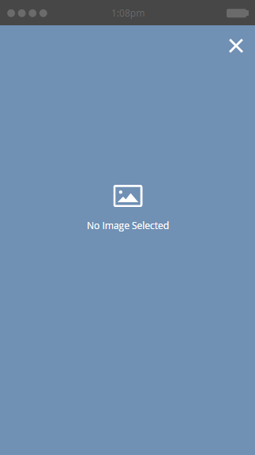

# 为应用程序内消息{#choose-a-layout-for-your-in-app-message}选择布局

Marketo为构建应用程序内消息提供了六个布局。

* 如果您没有提供内容的创意团队并且不需要特定的外观，则弹出式布局更为传统和理想。 您可以在Marketo中轻松创建和编辑您自己的应用程序内消息
* “全屏”布局允许您导入自己的已完成设计，从而提供完整的图形灵活性

## 弹出布局{#pop-up-layouts}

这三个弹出窗口布局了所有优惠预设设计元素，包括图像、文本、按钮和背景。

第一个弹出式布局是默认选择，原因很充分：它适合大多数用途。 它适用于分辨率较低的图像。 此布局将标准字体用于您的平台（Helvetica用于Apple，Roboto用于Android），因此它始终在手机或平板电脑上正确显示。 您可以上传和放置主图像和背景图像，编写您自己的主图像和支持文本，并配置主图像和关闭按钮。 文本以24像素限制为三行。 较大的文字大小会减少行数。

第二个弹出式布局会取消文本框，为较高的图像提供更多空间。 在导入图像之前，根据您选择的样式将文本添加到图像，以实现自定义外观。

如果您不需要在应用程序内消息中使用图像，则第三个弹出式布局非常好。 两个按钮优惠消息收件人可选择的操作。 文本限制为三行。 较大的文字大小将减少可用行数。

## 全屏布局{#full-screen-layouts}

这三种“全屏”样式布局设计为可导入完成的图形图稿。 选择您自己的字体并将其嵌入图形中，以匹配任何网页或促销活动。

第一个全屏布局优惠空白画布。 它将准确显示您上传的内容，而不拉伸或裁剪图像（请参阅下例）。 它会缩小以适合，并根据图像形状而在周围留下空白区域。 图像的任何部分都不会被删除。

请注意，此水平图像显示其全宽，上下留有空白。

第二个“全屏”布局添加文本字段和按钮。

与第一个全屏布局不同，此布局与第三个全屏布局（下面）一起扩展置入的图像以适合全高并裁切边。 这会根据原始图像创建出引人注目的背景图像。 此示例使用与上图所示相同的图像，

第三个“全屏”布局与第二个布局相同，但第二个按钮除外。 这为消息收件人提供了更多选项。

既然您了解了模板，现在应在[创建应用程序内消息图像](add-in-app-message-images.md)时选择模板。

>[!MORELIKETHIS]
>
>* [创建应用程序内消息](https://docs.marketo.com/display/docs/create+an+in-app+message)
>* [了解应用程序内消息](../../../../product-docs/mobile-marketing/in-app-messages/understanding-in-app-messages.md)

>

