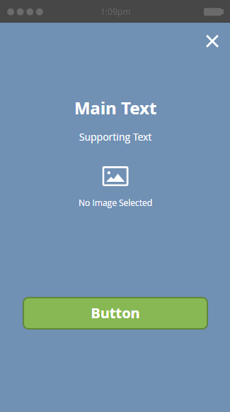

# 选择应用程序内消息的布局 {#choose-a-layout-for-your-in-app-message}

Marketo提供六种布局用于构建应用程序内消息。

* 弹出窗口布局更加传统，如果您没有创意团队提供内容并且不需要特定的外观，那么弹出窗口布局将是非常理想的选择。 您可以在Marketo中轻松创建和编辑您自己的应用程序内消息
* 全屏布局允许您导入自己完成的设计，从而为您提供完整的图形灵活性

## 弹出布局 {#pop-up-layouts}

三个弹出布局都提供了预设的设计元素，包括图像、文本、按钮和背景。

第一个弹出窗口布局是默认选项，原因很清楚：它适合大多数用途。 对于分辨率较低的图像，它工作正常。 此布局使用您平台的标准字体(适用于Apple的Helvetica、适用于Android的Roboto)，因此它始终显示在手机或平板电脑上。 您可以上传并放置主图像和背景图像，编写您自己的主文本和支持文本，以及配置主按钮和取消按钮。 文本限制为24像素的三行。 较大的文字大小会减少行数。

第二个弹出式布局消除了文本框，为您提供了更大的空间容纳更高图像。 在导入图像之前，以您选择的样式将文本添加到图像中，以便自定义外观。

如果您不需要在应用程序内消息中使用图像，那么使用第三个弹出窗口布局会很棒。 两个按钮为消息收件人提供了操作选择。 文本限制为三行。 较大的类型大小将减少可用行数。

## 全屏布局 {#full-screen-layouts}

三种“全屏”样式布局设计用于导入已完成的图形图稿。 选择您自己的字体并将其嵌入到图形中，以匹配任何网页或促销活动。

第一个全屏布局提供空白画布。 它可准确显示您上传的内容，且不会拉伸或裁切图像（请参阅下面的示例）。 它会收缩以适应，在周围留下空白区域，具体情况取决于图像形状。 未删除图像的任何部分。

请注意，此水平图像显示其全部宽度，上下留有空格。

第二个全屏布局添加文本字段和按钮。

与第一个全屏布局不同，此布局与第三个全屏布局（下方）一起扩展置入的图像以适合全高并裁切侧边。 根据原始图像，这可以创建一个引人注目的背景图像。 此示例使用的图像与上面显示的图像相同，

第三个全屏布局与第二个相同，只是第二个按钮不同。 这可为邮件收件人提供更多选项。

现在您已了解这些模板，接下来该选择一个 [创建应用程序内消息图像](/help/marketo/product-docs/mobile-marketing/in-app-messages/creating-in-app-messages/add-in-app-message-images.md).

>[!MORELIKETHIS]
>
>[了解应用程序内消息](/help/marketo/product-docs/mobile-marketing/in-app-messages/understanding-in-app-messages.md)
