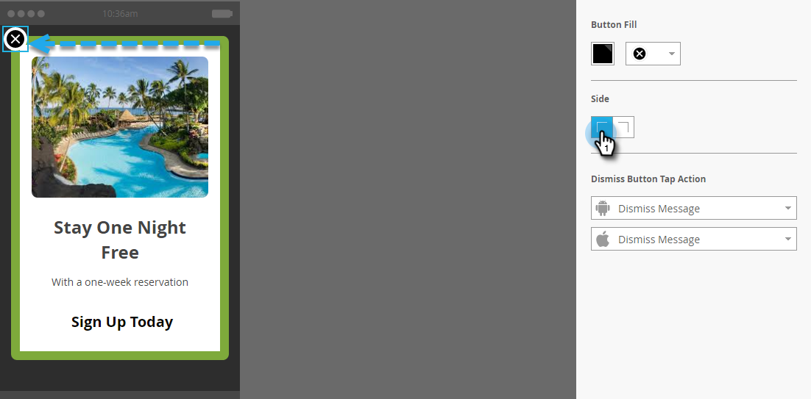

# 设置“取消”按钮并批准消息{#set-up-the-dismiss-button-and-approve-the-message}

## 配置“取消”按钮属性{#configure-dismiss-button-properties}

“取消”按钮有许多选项，可让您按所需方式配置它。

1. 在编辑器中，单击“取消”按钮。

   

1. 如果要更改按钮颜色，请单击颜色选择方块。 通过单击某种颜色或在拾色器上输入十六进制或RGB数字来选择该颜色。 默认为黑色。

   

1. 从下拉菜单中选择按钮设计。 圆形按钮包括全色和渐变选项。

   

   >[!CAUTION]
   >
   >从下拉菜单中选择其他设计时，按钮颜色可能在白色背景上显示为白色X。 如果是，只需在颜色选择方块中选择黑色或其他颜色，即可使白色X可见。

1. 您可以单击左角按钮，将取消按钮移到左侧（默认为右侧）。

   

1. 单击每个平台对应的下拉框，然后为“取消”按钮选择点按操作。

   

   >[!NOTE]
   >
   >您必须为“取消”按钮提供点按操作，因此没有复选框可启用它。 “取消消息”是默认（且明显）选项。

## 将其打包{#wrap-it-up}

您为图形、文本和按钮所做的所有选择均已自动保存。 现在，你准备好完成这个工作了。

1. 要预览应用程序内消息，请单击&#x200B;**消息操作**&#x200B;下拉框，然后选择&#x200B;**预览**。

   

1. 预览手机或平板电脑上的应用程序内消息，确保其正确显示。

   

1. 如果您对应用程序内消息感到满意，请单击&#x200B;**批准并关闭**。

   

   >[!NOTE]
   >
   >您还可以直接从“消息操作”下拉菜单中选择&#x200B;**批准并关闭**（请参阅第1步），但为什么不首先预览消息，这样才安全？

1. 要关闭编辑器而不进行批准，只需关闭选项卡。 它是自动保存的，因此您可以稍后返回并批准它。

   

有这么多选择，但现在您有了一条精美的应用程序内消息，随时可用！

现在是时候[发送消息](/help/marketo/product-docs/mobile-marketing/in-app-messages/sending-your-in-app-message/send-your-in-app-message.md)了。

>[!MORELIKETHIS]
>
>* [了解应用程序内消息](/help/marketo/product-docs/mobile-marketing/in-app-messages/understanding-in-app-messages.md)
>* [为应用程序内消息选择布局](/help/marketo/product-docs/mobile-marketing/in-app-messages/creating-in-app-messages/choose-a-layout-for-your-in-app-message.md)

