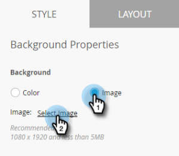

# 设置应用程序内消息背景 {#set-up-the-in-app-message-background}

选择消息背景是完成应用程序内消息的重要步骤。

>[!TIP]
>
>对于背景图像，纹理和渐变通常效果最佳。

1. 在编辑器中，单击背景区域。

   

1. 要设置颜色，请单击 **颜色**，然后选择“颜色选择方块”。 单击颜色或在拾色器中输入十六进制或RGB代码以选择颜色。

   

   >[!NOTE]
   >
   >默认情况下，纯白色通常是入选者。

1. 如果要使用背景，请单击 **图像** 然后 **选择图像** 链接。

   

1. 从上传到Design Studio的文件中进行选择。 单击 **选择**.

   

   >[!NOTE]
   >
   >图像大小限制为1440 x 2560像素和5MB。

1. 评估结果。 哦 — 也许纯色、纹理或渐变效果会更好！

   

1. 应用可选的图像边框。 默认设置为 **关闭**. 首先，通过单击颜色或在拾色器中输入十六进制或RGB号来选择颜色。

   

1. 单击箭头可改变边框宽度。 这个12像素宽的绿色边框会更改应用程序内消息的外观。

   

1. 使用滑块选择角半径。 从左到右选择一个位置：0、4、8、12或16像素。 默认为8像素（中心）选择。

   

1. 选中用于设置后台点按操作的框（默认情况下为关闭）。

   

   >[!NOTE]
   >
   >要点按背景的操作，您可以为Apple和Android平台设置不同的操作。 例如，在Apple和Android中，深层链接的处理方式不同。 如果消息仅发送到一个平台或另一个平台，请将另一个平台保留在默认设置中，或选择 **无**.

   要完成这个工作，你最后一步是 [设置“关闭”按钮](/help/marketo/product-docs/mobile-marketing/in-app-messages/creating-in-app-messages/set-up-the-dismiss-button-and-approve-the-message.md).

   >[!MORELIKETHIS]
   >
   >* [了解应用程序内消息](/help/marketo/product-docs/mobile-marketing/in-app-messages/understanding-in-app-messages.md)
   >* [发送应用程序内消息](/help/marketo/product-docs/mobile-marketing/in-app-messages/sending-your-in-app-message/send-your-in-app-message.md)
   >* [为应用程序内消息选择布局](/help/marketo/product-docs/mobile-marketing/in-app-messages/creating-in-app-messages/choose-a-layout-for-your-in-app-message.md)

