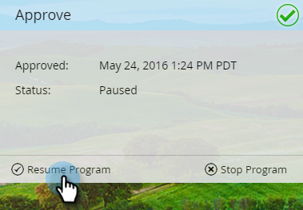

# 批准应用程序内消息 {#approve-your-in-app-message}

您需要在应用程序内消息发出之前批准发送。

1. 如果一切正常，请单击“ **批准并启动”**。

   

   >[!NOTE]
   >
   >如果发送过程的任何部分不完整，例如，应用程序内消息未获批准，将显示一条警告消息，指明需要您注意的区域。 请修复此问题，您应在步骤2中看到该消息。

1. 单击 **批准并启动**。

   

1. 如果您使用自定义字段，Marketo可能需要更长的时间才能运行，并将显示此消息。

   

1. 消息现在处于活动状态。

   

   >[!NOTE]
   >
   >通常需要15到30分钟，才能让项目中的访客看到经过批准的应用程序内消息。 请记住，如果您使用自定义字段，可能需要几个小时或更长的时间。

   您可以暂停或停止活动项目，但这两个选项之间有很大区别。

1. 如果 **需要停止项目** ，请单击“暂停项目”，但稍后将其恢复。 它将更改为“暂停 **”状** 态。

   

   >[!NOTE]
   >
   >暂停的原因可能只是暂停一段时间，或者您要修改消息或调整计划。 但是，您无法更改为其他消息，只编辑现有消息。

1. 当您希望暂停的项目继续运行时，单击“继 **续****项目**”。

   

1. 要完全停止项目，请单击“ **停止项目”**。

   

1. 如果确定要停止项目，请单击“停 **止**”。

   ** 

   **

   >[!NOTE]
   >
   >当您停止项目时，它不再运行，也无法恢复。 如果要再次运行它，您必须重新构建它。 因此，在单击“停止项目”之前，请确保您已完 **成项目**!

## 应用程序内仪表板 {#in-app-dashboard}

项目运行后，您可以使用应用程序内仪表板监视其性能，该在您批准项目后自动显示。 要返回项目，请单击右上角的链接，然后选择 **控制面板**。

就这些，伙计们！

